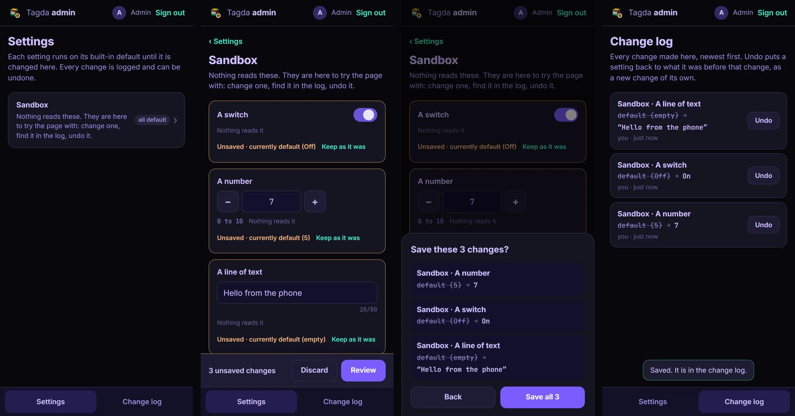
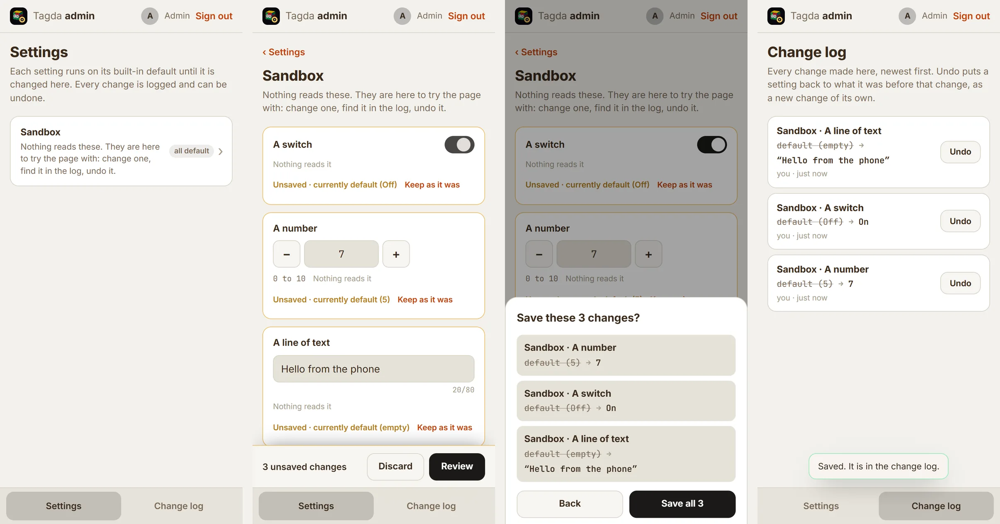
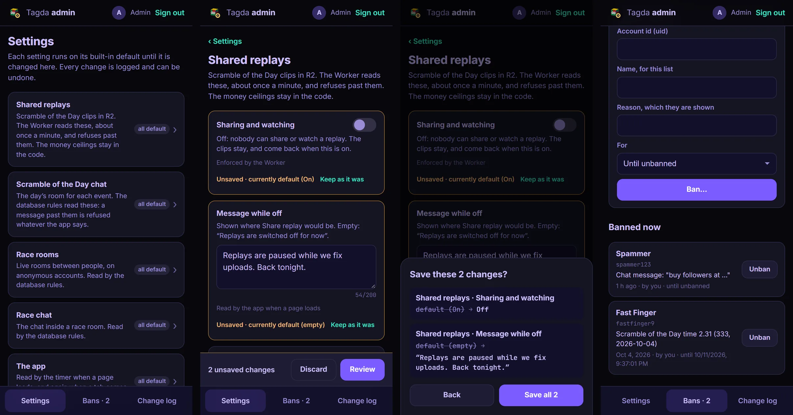
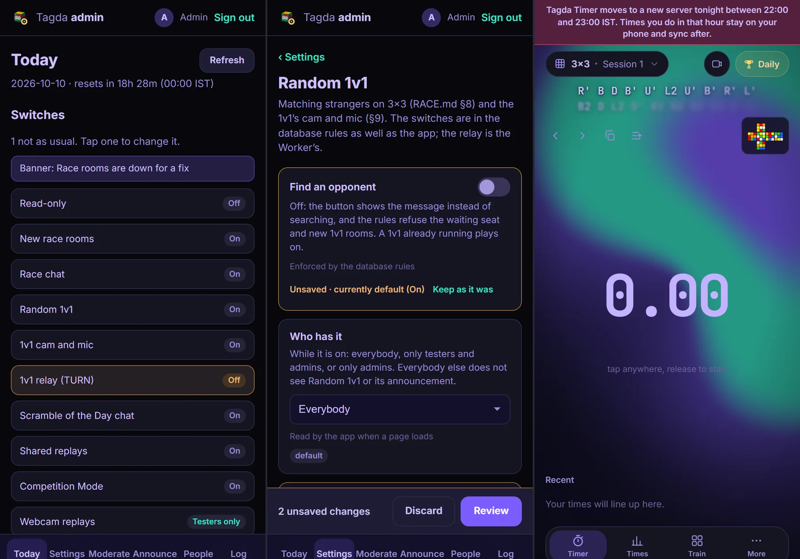
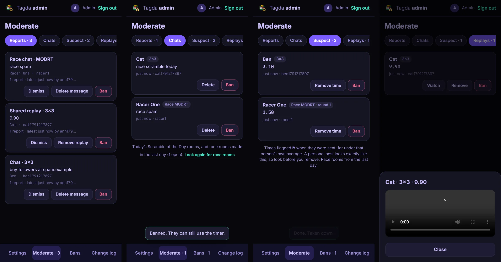
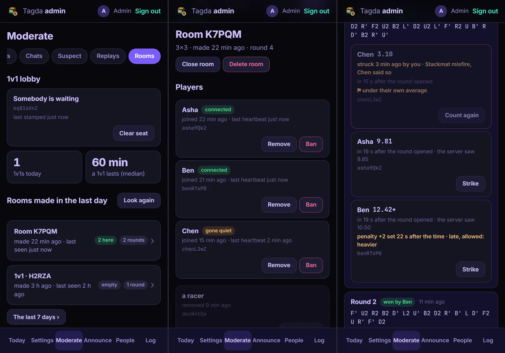
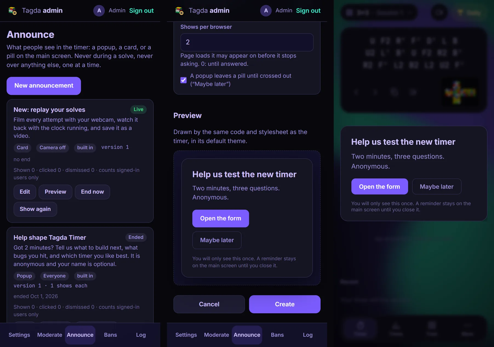
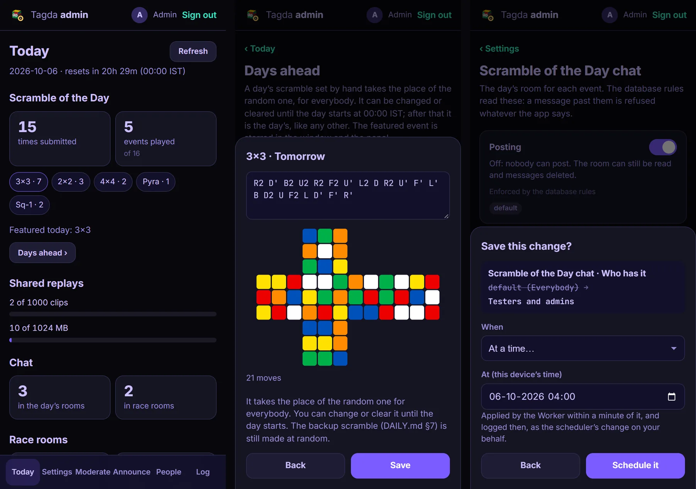

# The admin console

**tagdatimer.me/admin** is a page for the site's admins: the app's settings, changed from a
phone without touching code, bans, and a log of every change with an **Undo** on each one.
Anybody can open the address; only an account listed under `admins/` in the database gets past
the sign-in, and the database refuses everybody else's writes whatever the page shows them.

It is built in phases. Phase 1 laid the ground: who is an admin, the settings node and its rules,
the change log and the page. Phase 2 put real switches on it: shared replays, both chats, race
rooms, bans, and a way to make every open tab reload onto a new deploy (§4, §5). Phase 3 added
moderation: a report button, and one place to read every chat, flagged time and shared replay
of the day and take any of it down (§6). Phase 4 replaced the hand-written popups and cards with
announcements you write on the page (§7), and moved the support card, the feedback form, the
Spotify connection, the SOTD extras and race mode's tuning into settings (§3). Phase 5 added the
Today tab, with the day's numbers and what the page cannot see (§8), testers and a per-feature
audience (§9), changes scheduled for later (§10), and a day's scramble and featured event set
ahead (§11).



<details><summary>The same in the light theme</summary>



</details>

---

## 1. Turning it on

Once, in this order:

1. **Add yourself as an admin.** Firebase console → Realtime Database → Data. On the root,
   add a child `admins`, and under it a child named by your uid with the value `true` (the
   boolean, not the text `"true"`). The owner's uid is `8lSr96LEO1cdHDVlMDv8tCCFQag1`; anybody
   else's is in Authentication → Users. The console writes past the rules, which is the only
   way this node is ever written.
2. **Publish `firebase.rules.json`.** Realtime Database → Rules, paste, Publish.
3. **Deploy** as usual. For changes scheduled for later (§10), one secret,
   `FIREBASE_SERVICE_ACCOUNT`; everything else works without it.
4. Open **tagdatimer.me/admin** on the phone and sign in with the same Google account as the
   timer. *Add to Home Screen* (Safari's share sheet, or Chrome's menu) puts it there as
   **Tagda Admin**, with its own icon.

Step 1 comes first because the new rules stop trusting the uid they used to hard-code. Publish
them first and, until the entry exists, the rules refuse your SOTD × and your chat deletes, and
the app stops drawing them.

**Another admin** is the same as step 1 with their uid. **Removing one** is deleting their entry:
the database refuses their writes from that moment, cuts off an admin page they have open, and
the page drops to *This page is for the site's admins*.

---

## 2. Who is an admin

```
admins/<uid>: true      written by nobody from the client: the console only
                        readable by admins (the whole list), and by each account (its own entry)
```

In the rules, everywhere an admin may do something, the test is the same words:

```
auth != null && auth.token.firebase.sign_in_provider === 'google.com'
             && root.child('admins/' + auth.uid).val() === true
```

**Only Google sign-ins.** Race mode signs people in anonymously on the same project, and anyone
can mint an anonymous account with the public API key. Such an account never counts, even if
one were added to `admins/` by mistake (`tools/verify-admin-rules.mjs` tries exactly that).
Anything but `true` (`"yes"`, `1`) is not an admin either.

**Each account can read its own entry.** The brief said admins only; this goes one step past it,
on purpose. It lets the app and the Worker ask *am I an admin?* with one read of `admins/<uid>`,
and the answer gives away nothing but your own flag. The list as a whole is admins-only.

Where it is checked:

| Where | What an admin may do |
|---|---|
| `firebase.rules.json` | read every day's SOTD board and chat without having solved; read every race room; delete anybody's SOTD or race chat message; remove a SOTD time (`results`, `removed`, `progress/<uid>/submitted`, `replayClaim`, all in one write, DAILY.md §10) or a race time; clear a replay's flag; write `config`, `configMeta`, `configLog`, `bans`, `testers`, `configScheduled`, `sotdFeatured` and a day ahead's scramble; read and dismiss `reports`; read `configMeta`, `configLog`, `bans`, `testers` and the `admins` list |
| `worker.js` | delete anybody's shared replay; watch any (the board's read rule lets an admin through); get `x-replay-admin` when watching one, so the player offers **Remove** and **Remove and ban**; read `/replay/usage` (§8); have replays whatever their audience (§9) |
| `js/admins.js` | nothing: it only decides who is *shown* the buttons (`js/daily-net.js`) and who gets past the admin page's front door |

**Before the new rules are published** nothing changes. The old rules hard-code the owner's uid;
the Worker reads `admins/<uid>`, is refused, and falls back to `ADMIN_UIDS` in `wrangler.jsonc`;
the app is refused too and falls back to `LEGACY_ADMIN_UIDS` in `js/admins.js`. Both fallbacks
apply only to a *refused* read: once the rules know `admins/`, an answer of "not there" is final,
and `ADMIN_UIDS` matters again only if the rules are ever rolled back.

The gold badge on the owner's chat messages goes by the owner's uid (`OWNER_UID` in
`js/ownercard.js`). It is cosmetic, like the name match on the boards, and is not an admin check.

---

## 3. Settings

```
config/<section>/<key>   public read; written only by an admin, only together with its
                         log entry (§12), and only with a value of its type, inside its range
```

`js/config-table.js` is the one list of settings: `CONFIG`, a section per feature, each key with
its type, its **default** (the value the code used before there was a setting), its range, and
where it is enforced. Everything else is made from it:

- **The app** reads a setting with `getConfig(section, key)` (`js/config.js`): the stored value,
  clipped to its range, or the default when there is none, it is the wrong type, or the database
  could not be reached.
- **The Worker** imports the same table for `config/replays` (§4).
- **The rules**: `node tools/config-rules.mjs` writes the `config` block of `firebase.rules.json`
  from the table, one rule per key with its type and range, so the database refuses anything
  outside it too, and the `configScheduled` block (§10) with the same checks. `test.html` fails if
  the committed file and the table disagree.
- **The admin page** draws its forms from it: a switch, a number box with its range shown (in
  MB where the setting is bytes), a text field with a character count, or a list to pick from.
- **This file**: the table below.

**Reading it costs no connection.** The Firebase project is on the Spark plan, 100 connections at
once ([RACE.md](RACE.md), "Cost"), and a setting that changes a few times a week is not worth one.
The app makes one plain REST `fetch` of `/config.json` when a page loads (`loadConfig()`, in
`main.js`'s `wireConfig`), keeps it in `localStorage` for five minutes, and asks again when a tab
comes back into view or every half hour while it is in view. A change therefore reaches an open
tab within five minutes of it being looked at. If the fetch fails, the last copy or the defaults
stay in use and nothing breaks. The database rules read `config/` themselves, so a switch that the
rules enforce takes effect at once, whatever any tab has cached.

### Every setting

| Setting | Type | Default | Range | Enforced by | What it does |
|---|---|---|---|---|---|
| `replays.enabled` | switch | on | | Worker | Off: no sharing and no watching. The clips stay in R2 and come back when it is on |
| `replays.audience` | choice | everybody | everybody, testers and admins, admins only | Worker | Who has replays while they are on (§9) |
| `replays.message` | text | empty | 200 characters | app | Shown where **Share replay** would be while off |
| `replays.maxPerDay` | whole number | 1000 | 0 to **1000** | Worker | The first this many shares of the day, all events together |
| `replays.maxClipBytes` | MB | 10 | 1 to **10** | Worker (and the app's encoder) | The biggest clip; the copy is encoded to fit |
| `replays.dayBudgetBytes` | MB | 1024 | 10 to **1024** | Worker | Space for the whole day, all events together |
| `replays.keepDays` | days | 7 | 1 to **7** | Worker (and the app's ▶) | How long after its day a clip can be watched |
| `sotdChat.enabled` | switch | on | | rules | Off: nobody can post in the day's chat. Reading and deleting carry on |
| `sotdChat.audience` | choice | everybody | everybody, testers and admins, admins only | rules | Who has the day's chat while it is on (§9) |
| `sotdChat.message` | text | empty | 200 characters | app | Shown in place of the box you type in |
| `sotdChat.gapMs` | ms | 1500 | **1500** to 600000 | rules | Least time between two messages from one account |
| `sotdChat.maxLen` | characters | 200 | 20 to **200** | rules | Longest message |
| `race.enabled` | switch | on | | rules | Off: no new race rooms. Rooms already open carry on |
| `race.message` | text | empty | 200 characters | app | Shown in the race panel, and as the toast when a room cannot be made |
| `raceChat.enabled` | switch | on | | rules | Off: nobody can post in any race room's chat |
| `raceChat.message` | text | empty | 200 characters | app | Shown in place of the box you type in |
| `raceChat.gapMs` | ms | 500 | **500** to 600000 | rules | Least time between two messages from one account (new: there was no server limit before) |
| `raceChat.maxLen` | characters | 200 | 20 to **200** | rules | Longest message |
| `race.roomMax` | people | 24 | 2 to **24** | app | Room size, checked on join (the rules cannot count, RACE.md §2) |
| `race.graceSec` | seconds | 45 | 5 to 600 | app | How long a round waits for stragglers once everybody else is done |
| `race.hardTimeoutSec` | seconds | 75 | 30 to 600 | app | Silence before a racer stops counting for the round |
| `race.heartbeatSec` | seconds | 15 | **15** to 120 | app | How often each racer writes its presence: more often costs writes |
| `race.staleRoomMin` | minutes | 10 | 1 to 1440 | app | How long a player row may sit silent before a join reaps it |
| `race.rowsBeforeFold` | rows | 6 | 1 to 24 | app | Rows drawn before "+N more" |
| `race.suspectPct` | % | 45 | 10 to 90 | app | The ⚑ on race and SOTD boards: under this share of the person's own average |
| `sotd.events` | events | all 16 | any of them | app | Which events have a Scramble of the Day. Data already there stays |
| `sotd.countBoard` | switch | off | | app | The "most solves today" board (DAILY.md §6) |
| `sotd.autoDiscardMs` | ms | 2000 | 0 to 5000 | app | A main-scramble solve under this is a misfire, thrown away (DAILY.md §7) |
| `sotd.askMs` | ms | 5000 | 0 to 15000 | app | Under this, "misfire? Use backup / Keep" |
| `support.enabled` | switch | on | | app | The "Enjoying Tagda Timer?" card at all |
| `support.oddsPct` | % | 1 | 0 to 100 | app | Page loads that ask, after the first ask and the quiet days |
| `support.quietDays` | days | 30 | 1 to 365 | app | Quiet after somebody answers it |
| `support.shows` | times | 2 | 0 to 10 | app | Times it may come back on one page load |
| `feedback.url` | https link | the current form | 300 characters | app | The built-in feedback announcement's button (§7) |
| `feedback.endAt` | date and time | 1 Oct 2026 | | app | When that announcement stops |
| `spotify.enabled` | switch | on | | app | The built-in Spotify connection: off, Connect is turned off and nothing polls through it. Somebody's own connection is untouched |
| `spotify.message` | text | empty | 200 characters | app | Shown in the Spotify panel while off |
| `app.minVersion` | whole number | 0 | 0 to this deploy's version | app | Tabs older than this reload once they are idle (§4) |
| `app.banner` | text | empty | 200 characters | app | A strip across the top of the timer for everybody (§4) |
| `app.bannerKind` | choice | information | information, warning, outage | app | The strip's colour |
| `app.readOnly` | switch | off | | app | Sync holds its changes; races, 1v1s and the Scramble of the Day say so instead of starting (§4) |
| `duel.enabled` | switch | on | | rules and app | Random 1v1's **Find an opponent**: off, the waiting seat and new 1v1 rooms are refused |
| `duel.audience` | choice | everybody | everybody, testers and admins, admins only | app | Who sees Random 1v1 and its announcement (§9) |
| `duel.message` | text | empty | 200 characters | app | Shown in place of **Find an opponent** while off |
| `duel.searchSec` | seconds | 60 | 15 to 300 | app | How long one search lasts |
| `duel.refreshSec` | seconds | 10 | 5 to 60 | app | How often the person waiting re-stamps the seat (one write each) |
| `duel.staleSec` | seconds | 25 | 10 to 120 | app | A seat not re-stamped this long is abandoned; never under two re-stamps |
| `duel.showupSec` | seconds | 15 | 5 to 60 | app | Matched, but the other person never arrived: search again |
| `duel.goneSec` | seconds | 10 | 5 to 60 | app | The opponent out of the room this long ends the 1v1 |
| `duel.camEnabled` | switch | on | | rules, Worker and app | The 1v1's cam and mic: off, no new call is set up and no relay handed out |
| `duel.turnEnabled` | switch | on | | Worker | The TURN relay, the one part billed by the gigabyte (§4) |
| `duel.turnTtlMin` | minutes | 240 | 10 to **240** | Worker | How long a relay login lasts |
| `competition.enabled` | switch | on | | app | Off: no new Competition Mode set. One under way can be finished |
| `competition.message` | text | empty | 200 characters | app | Shown in place of the setup while off |
| `features.webcamReplay` | switch | on | | app | Webcam replays: off, nothing records (§4) |
| `features.webcamReplayAudience` | choice | everybody | everybody, testers and admins, admins only | app | Who has them while on |
| `features.webcamReplayMessage` | text | empty | 200 characters | app | Shown in the camera panel while off |
| `features.stackmat` | switch | on | | app | Stackmat input: off, a timer on one goes back to the keyboard |
| `features.stackmatAudience` | choice | everybody | everybody, testers and admins, admins only | app | Who has it while on |
| `features.stackmatMessage` | text | empty | 200 characters | app | Shown under the input picker while off |
| `sandbox.*` | switch, number, text | off, 5, empty | | nothing | Nothing. For trying the page |

The bold end of each range is the **ceiling**: the side that would cost money, storage, or let
abuse through faster, pinned at the value the code used before.

### Ceilings

The limits that keep the bills at zero stay in the code as hard ceilings, and a setting may
only go *below* them:

| Ceiling | Where it lives | The setting under it |
|---|---|---|
| 10 MB a clip | `CLIP_MAX` in `wrangler.jsonc`, and in `sotd-replays.js` | `replays.maxClipBytes` |
| 1 GB a day | `DAY_BUDGET` in `wrangler.jsonc` | `replays.dayBudgetBytes` |
| 1000 clips a day | `PER_DAY` in `worker.js` (one page of R2's `list`) | `replays.maxPerDay` |
| 7 days after the day | `KEEP_DAYS` in `worker.js` (the bucket's lifecycle rule deletes at 8) | `replays.keepDays` |
| A relay login of 4 hours | `TURN_TTL` in `worker.js` | `duel.turnTtlMin` |
| Workers Free | `wrangler.jsonc`, the account | none: no setting touches the plan |

Each is enforced three times. The table's range ends at the ceiling, the rules refuse a stored
value past it, and the Worker clips again with `min(setting, ceiling)`, so even a value put
straight into the database from the console (which skips the rules) cannot raise a limit. That
last case is tested: `maxClipBytes` stored as 20 MB still refuses an 11 MB clip. Raising a
ceiling is a code change and a conversation, never a setting.

### Adding a setting

1. Add it to `CONFIG` in `js/config-table.js`, with today's value as its default and the
   ceiling at the end of its range that costs more. Say where it is enforced (`where`).
2. `node tools/config-rules.mjs` rewrites the rules block.
3. Use `getConfig()` where the old constant was used. Anything about money or abuse must also be
   enforced by `firebase.rules.json` or `worker.js`: a setting only the app reads protects nothing.
4. Spanish for its label in `locales/es.js` (`test.html` checks), a row in the table above, and
   publish the rules.

A new **feature** also gets an `audience` key (§9), defaulting to `admins`, so it can go out to
admins, then testers, then everybody, without a deploy between.

---

## 4. The safety switches



Each switch has a **message** beside it, shown to people while it is off ("Race is down for
maintenance, back at 6 pm"). Empty, they see a plain default. Turning a switch off never touches
the timer, a solve, or a time already on a board.

### Shared replays (the Worker)

`worker.js` reads `config/replays` over REST, with no token (it is public), and keeps it for a
minute (`CONFIG_TTL_MS`; the dev rig makes that 1.5 s). The order of a share
(DAILY.md §8) becomes:

1. path and day → **switched on?** (`503 off`, with the message) → headers, and the clip under
   `min(maxClipBytes, CLIP_MAX)` (`413`) → the body → a Google account with a result →
   **not banned** (`403 banned`, §5)
2. **the claim**: write-once, this account's one share for the event today
3. the day's count entry (`replayDay/`, below)
4. `list` the day → **fewer than `min(maxPerDay, 1000)` clips** (`429 slots-full`,
   *Today's replay slots are full*) → under `min(dayBudgetBytes, DAY_BUDGET)` (`507 full`)
5. `put`, then the flag

Watching asks the switch too (`503 off`), and `keepDays` (`410`). Deleting never does: an admin
can always take a clip down.

**A full day costs the share.** The claim is written before the count and the budget are checked
(steps 2 and 4). That order is what bounds R2's writes: nothing reaches R2 without a write-once
claim, so a flood of uploads cannot run up Class A operations. The price is that somebody turned
away because the day is full has used their one share for that event that day. So the app checks
first: before encoding anything it reads the day's count, one entry per claim under
`replayDay/<dayKey>/<event>/<uid>` (written by the Worker after the claim, readable by anybody
signed in, never deleted except by the sweep of days older than yesterday), and says *Today's
replay slots are full* without spending anything. The count is all events together, the same as
the Worker's. Only two shares racing for the last slot can still be turned away after their claim.

The app hides **Share replay** when replays are off or the day is full, and says why in its
place. The ▶ on the boards goes while they are off.

### The day's chat and race chat (the rules)

The rules read `config/sotdChat/*` and `config/raceChat/*` directly, with today's numbers when
the node is missing:

- `enabled: false` refuses every new message. Reading carries on, and deletes still work.
- `maxLen` caps the text (200 without it).
- `gapMs` is the time `last/<uid>` (SOTD) or `chatLast/<uid>` (race) must be behind `now` before
  a new message: 1500 ms and 500 ms without it, and those are also the floors. The app waits half
  a second longer than the rule, so a fast connection after a slow one is not refused.

**Race chat has a rate limit now.** It had none on the server (only `CHAT_COOLDOWN_MS`, 700 ms, in
the client), and anonymous accounts can post. A message must arrive in the same update as
`rooms/<id>/chatLast/<uid>` set to the server's `now`, like the day's chat. A client on rules from
before this sends the message alone, which those rules accept; a client that has seen the new
shape work tries it first, and the other once if refused, so a tab open while the rules are
published keeps talking.

While off, the box you type in gives way to the message.

### Race rooms (the rules)

`race.enabled: false` refuses a room's `meta` when it does not exist yet: no new rooms. Rooms
already open carry on (their next rounds, their phase, people joining by code). The race panel
says so under **Create a room**, and pressing it, or following an invite to a room that does not
exist, toasts the message. Local mode (other tabs of your own browser) is not affected.

### Random 1v1 (the rules, the app and the Worker)



Random 1v1 had no switch before this: turning it off meant a deploy.

- **`duel.enabled: false`** refuses `rooms/_1v1_333/meta/waiting` (the one seat everybody
  queues through) and a room's `meta/kind` becoming `duel`, so neither a search nor a new 1v1 can
  start, whatever a cached tab thinks. Clearing the seat is never refused. A 1v1 already running
  plays on to its end. The app reads the switch too: the drawer's card shows the message where
  **Find an opponent** was, and the launch announcement (the card on the race flag) is not shown.
- **`duel.audience`** is the app's alone: an account outside it does not see the card or the
  announcement. The rules do not check it, so a tester-only 1v1 is a soft launch, not a lock.
- **The tuning** (`searchSec`, `refreshSec`, `staleSec`, `showupSec`, `goneSec`) replaces the
  `MATCH_*` constants in `js/raceapp.js`, which are now only its defaults. The app never lets a
  seat count as abandoned inside two of its own re-stamps, whatever `staleSec` says.
- **`duel.camEnabled: false`** refuses the call's setup under `rooms/<id>/rtc/<uid>` (deleting
  your own still works), hides the cam and mic tile in new 1v1s, and makes the Worker's `/turn`
  answer `403 off`. A call already connected carries on until its 1v1 ends.
- **`duel.turnEnabled: false`** is the Worker's alone: `/turn` answers `403 off`, and
  `js/race-cam.js` connects with STUN alone, as it always has when the Worker has no TURN key.
  Most pairs still connect; two players both behind strict NATs see *Couldn't connect*. It is the
  only switch here that saves money: Cloudflare's TURN is free for 1,000 GB a month, then
  $0.05/GB, and nothing else in the site bills by the gigabyte.
- **`duel.turnTtlMin`** shortens the relay login the Worker asks Cloudflare for, never past 4
  hours (`TURN_TTL`). The Worker reads `config/duel` like `config/replays`: over REST, kept a
  minute.

### Competition Mode (the app)

`competition.enabled: false`: **Start Competition Mode** shows the message instead of the setup.
A set already under way can still be finished (stopping it halfway would lose it), and its
history still opens. Sets keep syncing as before.

Two things in the plan for this switch were left out on purpose. A rules-side stop for uploading
sets (`syncEnabled`) would make the database refuse an entry at the front of the sync queue,
and since the queue is first in, first out (#151) that one refusal would hold back every later
write on that device, the freeze #152 fixed. And a cap on the X in AoX had no case behind it.

### Features (the app)

One switch, one audience and one message per part of the timer that leans on one browser
feature, so a part that breaks on one browser can be switched off, or given to testers first,
without a deploy. `featureOn(name)` in `js/audience.js` answers for the app.

| Switch | Off means |
|---|---|
| `features.webcamReplay` | Nothing records: the camera is let go, the camera panel shows the message instead of its switch, the webcam announcement is not shown, and Competition Mode starts with *No replay*. A person's own **Webcam replay** setting is kept, and comes back on with the switch. Replays already on a device can still be watched |
| `features.stackmat` | The timer cannot use a Stackmat: a timer set to one goes back to the keyboard (once it is idle, never mid-solve) and lets the microphone go, until the switch is back |

These are the two with a real gate: each has one place the app decides whether it runs at all.
The plan also listed the alg trainer, learn mode, FMC, BLD trace, the solver's hints and the side
scrambler. They were left out: most are imported with the page, so a switch could only hide a
button while the code still loads (a module that fails to load fails the whole page either way),
and the side scrambler is what makes Square-1 and Clock scrambles, so it cannot be switched off.

### Read-only and the banner (the app)

- **`app.banner`** puts a strip across the top of the timer for everybody, in `app.bannerKind`'s
  colour (the theme's for information, amber for a warning, red for an outage). The app gives up
  the strip's height, so nothing is covered. It goes when the text is emptied.
- **`app.readOnly`** is for an outage, or before a risky rules publish. Timing goes on as normal
  and every solve is saved on the device. Sync **holds**: its queue keeps every change, in order,
  sends nothing, and sends them all once the switch is off (Data Health says *cloud sync is paused
  for maintenance*). Joining or making a race room, finding a 1v1 and opening the Scramble of the
  Day say so instead of starting, with the banner's text, or a plain default when the banner is
  empty (the strip then shows that default too).
- It is **not enforced by the rules**, on purpose: a check in every write rule would bloat them
  and slow every write. A tab with an old cached copy of the settings can still write until it
  next reads them (within five minutes of being looked at). The real lock is unpublishing rules
  in the Firebase console.

### The switches on Today

Today's first block lists every on/off switch with its state: **On**, **Off**, **Testers only** or
**Admins only**, and the banner if one is up. A switch that is not in its usual state (anything
off, or read-only on) is drawn in the warning colour, so a glance says what is down. Each one
opens its settings section.

### A new version (the app)

`js/version.js` has `APP_VERSION`, the same number as `?v=` in `index.html`, bumped with it on
every deploy (`test.html` checks). When `app.minVersion` is higher, a tab is running a deploy you
have retired. It says *A new version is ready — reloading* and reloads, once nothing is going on:
the timer is idle (never during a solve or inspection), no panel is open, the tab is not in a race
room or the SOTD window, and nothing is being typed. Before reloading it asks the service worker
to drop its cache, so the reload cannot come back up on the same old files.

Today a JavaScript-only deploy can take up to 3 days to reach somebody (`MAX_AGE` in `sw.js`).
With this, raise `minVersion` to the new deploy's number and every open tab moves within minutes
of being looked at. It reloads at most once per value per tab, so a typo costs one reload, never
a loop, and the admin page refuses a value above its own version (the page is never cached, so
its version is the deployed one).

---

## 5. Bans

```
bans/<uid>: { at, by, reason, name?, until? }   written by an admin; readable by admins, and by the account itself
```

A banned account cannot post in either chat, share a replay, or put a time or a note on the
Scramble of the Day board. The timer, and the account's own synced solves, are untouched.
Without `until` it lasts until an admin lifts it; with one, it ends by itself (nothing has to
delete it).

| Where | What it stops |
|---|---|
| `firebase.rules.json` | `daily/…/chat/m/<id>` (post), `results/<uid>` (submit), `results/<uid>/note`, `replayClaim/<uid>`, `rooms/…/chat/<id>` |
| `worker.js` | `PUT /replay/…`: `403 banned`, before the claim, so nothing is spent |
| the app | says why instead of offering it: the window's scramble line, the chat box, the note field, Share replay |

**Banning.** In the timer, an admin's delete on somebody's SOTD chat message, the × on their board
row, and **⋯** on their shared replay each offer a second choice, *Delete and ban* or *Remove and
ban*, never the default. The reason is filled in from what was removed. On the admin page,
**People › Bans** lists every ban with **Unban**, and can ban by uid with a reason and a length (until
unbanned, a day, a week, 30 days). A ban is not a setting, so it is not in the change log; the
record itself says who made it and when.

**Race accounts are throwaways.** A ban on an anonymous race account lasts only as long as that
tab's account, so it is little use against somebody determined. The rules apply it all the same.

---

## 6. Moderation



The **Moderate** tab is five views over today, read live on the admin page's one connection.
The fifth, **Rooms**, has a section of its own below ("Race rooms and 1v1").
An admin reads all of it without having done the scramble: the read rules on a day's `results`
and `chat` let an admin through, and `rooms` is readable by admins as a whole.

| View | What is in it | What you can do |
|---|---|---|
| **Reports** | open reports, one card per item, however many people reported it | **Dismiss** (the reports go, the item stays), **Delete** it (the reports go too), **Ban** its author |
| **Chats** | the newest 25 messages of every event's SOTD room today, and of every race room made in the last day, newest first | **Delete**, **Ban** |
| **Suspect** | today's SOTD times and recent race times flagged ⚑ when they were sent | **Remove time**, **Ban** |
| **Replays** | today's shared replays | **Watch** (through the Worker, like anybody), **Remove**, **Ban** |

**Delete** asks first, saying what will happen, and offers *…and ban* beside it. Removing a SOTD
time is the same removal as the × on the board (DAILY.md §10): the person gets the backup
scramble, or is done for the day if it was the backup, and the clip goes too. Removing a replay
deletes the clip through the Worker and clears the row's flag, so the ▶ goes for everybody.
Removing a race time takes it off that round's board; the racer could submit for the round
again, which is fine for rooms that are not a competition. Race rooms are found by
`meta/createdAt` (indexed in the rules) from the last day; **Look again for race rooms** asks
again, since rooms are never cleared out of the database and are not watched as a whole.

### Reporting

```
reports/<pushId>              { by, at, kind: 'chat' | 'raceChat' | 'replay' | 'result', path, text? }
reportOnce/<uid>/<kind|path>  the report's id: one per account per item, readable by its owner
```

A **⚑** sits beside somebody else's message in the day's chat (hover, or always faintly on a
touch screen), and beside a race chat message when this browser is signed in with Google. A
shared replay has **Report this replay** under the player's **⋯**. Each asks first, then says
*Reported. An admin will look at it.*, or *You have already reported that*.

The rules ask that the reporter is a Google account and not banned (race mode's anonymous
accounts cannot report, which is why the race ⚑ needs the timer's own sign-in), that `path` has
the shape its `kind` says and exists (a replay report needs the row's `replay` flag), that `by`
and `at` are the reporter and the server's clock, and that the matching `reportOnce` entry is in
the same update. That entry is write-once and never deleted, so a dismissed report cannot be
filed again by the same person. Reports are readable and deletable by admins only. `result` is
accepted by the rules for a board row, but nothing in the app offers it yet: a flagged time is
already in **Suspect**.

### Race rooms and 1v1



**Moderate › Rooms** lists the race rooms made in the last day (the same read as Chats): each
with its code, whether it is a 1v1, how many people are in it now, how many rounds have times,
and when it was made and last seen. **The last 7 days ›** reads a week of rooms once, on asking,
and narrows them to one person: a uid finds every room they raced, posted or sat in, and part
of a name finds them by the name they used. Rooms stay in the database (a racer can't delete
one; the "last one out" clean-up in `race-net.js` is refused by the rules), so a week back is
there to read.

Tapping a room opens **the inspector**, which listens to that room while it is open:

| Block | What it shows |
|---|---|
| Players | name, uid (tap to copy), when they joined, their last heartbeat, connected or gone quiet (past `race.hardTimeoutSec`), and anybody removed |
| Rounds | newest first, from `rounds/<n>`: the scramble, the winner, and every time with how long after the round opened it came in, what the server timed between its own start and finish stamps, its penalty and **when the penalty changed** (`penaltyAt`, see below), and its flags |
| Flags | the ⚑ the racer's own app set (far under their own average), and a time under `race.suspectPct` of the round's median when at least three people have a time (two people are a 1v1, not a field) |
| Chat | the room's last 30 messages, each with **Delete** |

A penalty lightened or cleared more than 15 s after submitting is refused by the rules (#164).
A heavier one is allowed at any time, and the inspector marks it *late, allowed: heavier*. A
penalty changed before this version has no time kept with it, and says so.

**The room's actions** are one write each, to `rooms/<id>/mod`, which only an admin may write and
every racer in the room listens to:

```
rooms/<id>/mod/closed               { at, by }           the room is closed
rooms/<id>/mod/kicked/<uid>         <time>               this person was removed
rooms/<id>/mod/struck/<round>/<uid> { at, by, reason? }  this time does not count
```

| Action | What happens | Undo |
|---|---|---|
| **Close room** | Every tab in it says *A moderator closed this room* and leaves. The rules refuse its heartbeats, new players, new times and new chat. Its rounds and chat stay to look at | **Reopen** |
| **Remove** a player | Their row goes and the mark is set, in one update. Their tab says *A moderator removed you from this room* and leaves, and the rules refuse their rejoining, their times and their chat in that room. Other rooms are not affected: to keep somebody out of everything, **Ban** (beside it) | **Let back in** |
| **Strike** a time | It stops counting on every screen in the room: out of the round, the standings and Race stats, shown as ✕ *Removed by a moderator*. The time itself stays, so it can be counted again. An optional reason is kept with it | **Count again** |
| **Delete room** | The whole room goes for good. Typing its code is the confirmation. For test junk (the `rooms/ZXCVB` leak) or a room past saving | none |

These marks sit beside `meta` rather than in it on purpose: any racer may write a room's `meta`
(that is how a room runs itself), so a mark there could be wiped by a player.

**The 1v1 lobby** (on Moderate › Rooms and on Today) shows the one waiting seat,
`rooms/_1v1_333/meta/waiting`: empty, somebody waiting (their uid and when they last re-stamped
it), or two people matched and joining. A seat not re-stamped for longer than `duel.staleSec`
(and never under two re-stamps) is marked abandoned. **Clear seat** empties it with a
transaction that only clears the seat it showed: a claim made in the meantime is left alone,
and the page says so. Beside it: the day's 1v1s and how long one lasts (the median, from a
1v1's creation to the last thing that happened in it).

**The 1v1 relay** (on Today) counts the TURN relay logins handed out today. The app counts each
time it asks the Worker for one, before asking:

```
turnDay/<dayStart>/<uid>    a count: +1 at a time, today only, read by its owner and by admins
```

Today shows the day's total, how many people, and the five with the most. Days older than 14
are swept when the page opens. Bytes relayed are only on Cloudflare's dashboard.

There is deliberately **no per-person cap** on relay logins (the plan's `duel.turnPerDay`). One
login relays any number of gigabytes for as long as it lasts, so a count of logins bounds
nothing that costs money, and the Worker has no way to tie a request to a count without a
server-side counter of its own. The money switch is `duel.turnEnabled` (§4), and
`duel.turnTtlMin` shortens what one login is worth.

## 7. Announcements



```
announcements/<id>   { title, text, button?: { label, action: 'link' | 'panel', target },
                       style: 'popup' | 'card' | 'pill', audience, startAt, endAt?, maxShows,
                       version, reminder?, log, by, updatedAt }        public read; admin write
annStats/<id>/<version>/<uid>   'shown', then 'clicked' or 'dismissed'  admins read
```

What the timer used to show from hand-written code (the webcam card under the camera, its twin
in the SOTD window, and the feedback form's popup with its pill) is one system now. The app reads
`announcements.json` with the same plain REST fetch as the settings, and shows at most one at a
time, with the old cards' manners: never during a solve or inspection (one on screen steps aside
when an attempt starts and comes back after it), never over a panel, a dialog or the support card,
never in a hidden tab, never a second one on a page load once one is answered, and inside the SOTD window only a card about a button the window has (the
camera). An answer (the button, Not now, ×, Escape) is remembered in `localStorage` by id and
version; a show counts once per page load against `maxShows` (0: until answered).

**Styles.** *Popup*: a dialog in the middle. With `reminder`, Maybe later leaves a *pill* on the
main screen until it is crossed out, which is what the feedback form did. *Card*: under the
button of the panel it opens, with an arrow, while a ring pulses on that button (in the SOTD
window, under the window's own camera button; where the top bar is folded away, at what holds the
button: on a phone the dock's tab, above it (race: Train), on a narrow screen the ☰ menu), or in
the corner when it has no panel. *Pill*: a slim button at the top of the timer.

**Audiences.** *Everyone*; *Signed in* (a Google session on this browser); *Camera off* (webcam
replay not on); *Has not opened that panel* (the panel the button opens, never opened on this
browser; for a link, until answered); *New* (fewer than 50 solves on this device); *Returning*
(50 or more).

**The button** opens a link (https only, in a new tab) or a panel: webcam replay, the Scramble of
the Day, race, statistics, appearance, settings, Spotify, gear or About.

**Built in.** Three are part of the app, so they behave with no database at all. The first two
keep the answers people gave the old cards (carried over once, from the old flags):
`webcam-replay` (a card, audience *Camera off*, until answered) and `feedback` (a popup with a
reminder pill, its link and end from `config/feedback`; it ended on 1 Oct 2026). The third,
`random-1v1`, launches random 1v1: a card for everyone under the race flag, with an arrow, on up
to three page loads until answered, whose **Try it** opens the Race panel, from 7 Oct to 7 Nov
2026 (00:00 IST). It is version 2: version 1 was a popup in the middle of the screen. The old camera
card's second version, "Your attempt will be filmed" for people who already had the camera on, is
gone: its audience is no longer anybody the card is for. Editing a built-in one on the page saves a
copy in the database, which replaces it. The built-in ones are in Spanish for people who chose it;
anything written on the page is shown as written.

**The Announce tab** lists every announcement with whether it is live, scheduled or ended, its
version, and its numbers. **Edit** opens the editor, whose **Preview** is drawn by the same code
and stylesheet as the timer (`announce-ui.js`, `css/announce.css`). **End now** sets its end to
now. **Show again** bumps the version, so everybody in its audience who answered is asked once
more; an ended one starts again for a week. Saving never shows anything again by itself: an edit
keeps the version.

**What the rules hold.** Only an admin writes an announcement, never deletes one, and only with a
`configLog` entry in the same update (`path: 'ann/<id>'`, with an `action`), which the change log
shows. The version can only go up (down would ask again people who answered a later one). Every
field is typed and capped as above; a link must be https, a panel one of the list.

**Stats** count signed-in browsers only, and the page says so beside the numbers. Each account has
one record per announcement and version: it becomes `shown` the first time, then `clicked` or
`dismissed`, and never anything else, so nobody can inflate a count by reloading.

## 8. Today



The tab the page opens on: the day so far, by the server's clock (it turns over at 00:00 IST).

| Number | Where it comes from |
|---|---|
| Every switch, on or off, and the banner (§4) | `config/`, the copy the Settings tab edits |
| The 1v1 lobby: the waiting seat, the day's 1v1s and how long one lasts | a listener on the seat, and the Moderate tab's read of the last day's rooms (§6) |
| The 1v1 relay: logins handed out today, by how many people, the top five | `turnDay/<today>`, read over REST as this admin |
| Scramble of the Day times, per event, and the day's featured event | the Moderate tab's listeners on today's boards |
| Replays: clips against `replays.maxPerDay`, bytes against `replays.dayBudgetBytes` | the Worker's `GET /replay/usage`, admins only: one R2 `list` of today's clips (the same list a share makes), with the limits in force |
| Chat messages in the day's rooms, and in race rooms | each event's room read with `?shallow=true` over REST, so only the message ids come down; race rooms from the Moderate tab's read |
| Race rooms open now (somebody seen within `race.staleRoomMin`), the people in them, rooms made in the last day | the Moderate tab's read of the last day's rooms |
| Open reports, active bans, testers | their listeners |
| What is scheduled next | `configScheduled` (§10) |

The reads (the Worker's list, the chats' sizes) happen when the tab opens and on **Refresh**, at
most once a minute. Nothing on this tab is a new listener.

**What it can't see** is listed beside the numbers, with where to look: the database's
connections (Spark: 100 at once) and downloads (*Firebase › Realtime Database › Usage*), the
Worker's requests (*Cloudflare › Workers*), and billing (*Cloudflare › R2*, the only part that bills
past its free tier rather than failing; *Firebase › Usage and billing*). None of them can be read
from a browser without a credential this page should not hold, so none is guessed at.

## 9. Testers and audiences

```
testers/<uid>               { at, by, name? }               admins write and read the list; each account reads its own
config/<section>/audience   'everyone' | 'testers' | 'admins'   default everyone
```

**A tester** is an account an admin added on the **People** tab. Its picker finds names on today's
boards and in today's chats; anybody else goes in by account id. Admins count as testers too. It
needs a Google sign-in on the timer. (The brief's shape was `testers/<uid>: true`; the entry keeps
who added it and when, and a name for the list. The rules only ask that it exists.)

**An audience** turns a feature on for testers, or for admins only, before everybody. While the
feature is switched on, its audience decides who has it, and anybody outside it sees nothing of
it: no "switched off" line, no button. Today that is:

| Feature | Setting | Enforced by | Outside the audience |
|---|---|---|---|
| Shared replays | `replays.audience` | the Worker: sharing and watching both answer `403 not-yet` | no Replays tab, no ▶, no Share replay |
| The day's chat | `sotdChat.audience` | the rules: the message is refused | no chat column, no Chat tab |
| Announcements | an announcement's own audience | the app (an announcement protects nothing) | *Testers (and admins)* and *Admins only* on the Announce tab |

A new feature gets an `audience` key in its section (a `choice` of `AUDIENCES` in
`js/config-table.js`), with `audienceRule(section)` from `js/config-rules.js` in the rules or
`inAudience` in the Worker wherever the server decides, and `hasFeature(section)` in the app.

**Race rooms and race chat have none.** Race accounts are anonymous, so neither the rules nor the
Worker could tell a tester from anybody, and an audience the server cannot check would be a
suggestion.

**How the app knows.** `js/audience.js` reads the account's own `testers/<uid>` and
`admins/<uid>`, once per account per page, on the connection the signed-in app already holds,
never a new one. It keeps the answer in `localStorage`. Until the database has answered, nobody is
a tester, so a feature for testers appears a moment after the page loads instead of flickering
off. Signing out is nobody's.

## 10. Scheduled changes

```
configScheduled/<section>/<key>/<pushId>   { to | def: true, at, by, createdAt }   public read; admins write
```

Any change can wait for a time instead of applying now: **When** in the review sheet, *At a
time…*, in the phone's own clock, from a minute to a year ahead. Changes reviewed together get the
same time. A scheduled change is listed under **Scheduled** at the top of Settings, on its own row
(*Scheduled: … on …*, with **Cancel**), and on Today. It is checked when it is made exactly as the
setting is (type, range, ceiling), so a schedule cannot raise a limit either. Like `config`, it can
be read by anybody.

**The Worker applies it**, once a minute: a Cron Trigger in `wrangler.jsonc`, part of Workers Free.
A minute with nothing due costs one small public read. When something is due, the Worker signs in
as an account of its own, `tagda-scheduler`, with a custom token it signs with a service-account
key (the `FIREBASE_SERVICE_ACCOUNT` secret). Per change, it writes the same chain a Save writes, in
one update: the value, its `configMeta` pointer, a `configLog` entry, and the schedule deleted. The
log shows it at the moment it applied, as *scheduled by* the admin who made it.

**The scheduler can do one thing.** The rules name its uid only together with the custom sign-in,
which no browser can make. It may write a setting only when its log entry names a schedule that
exists, is due (`at <= now`), is deleted in the same update, holds exactly the value being
written, and was made by somebody who is still an admin. It cannot schedule anything, ban, write an
announcement, delete a schedule without applying it, or change a setting the way an admin does.

**Overdue.** A schedule more than three minutes late is marked *Overdue* on the page. In order of
likelihood: the secret is not set or its key was revoked (the Worker's log says
`schedule: no-credential` or `sign-in-refused`); the admin who made it has been removed since (the
rules refuse it: cancel it, or schedule it again). Anything else (the setting changed a moment
before) is tried again the next minute.

**The secret.** Firebase console → Project settings → Service accounts → *Generate new private
key*, then the whole JSON file as a secret:

```
npx wrangler secret put FIREBASE_SERVICE_ACCOUNT
```

(or Cloudflare dashboard → Workers & Pages → tagda-timer → Settings → Variables and Secrets → Add,
type *Secret*). The key could do anything on the Firebase project, so it lives only there, and the
Worker uses it for nothing but the scheduler's sign-in. Deleting the key in Google Cloud (IAM →
Service accounts → the account → Keys) stops scheduled changes and nothing else. Without the
secret, everything but scheduling works as before.

## 11. Days ahead

```
daily/<dayStart>/<event>/scramble   today's: anybody signed in, once, as before
                                    a day ahead: admins only, and changeable until the day starts
sotdFeatured/<dayStart>             one event id, for today or a day ahead; public read; admins write
```

**Days ahead**, from Today: today and the next thirteen days. For each day, its **featured event**
(saved as soon as it is picked) and each event's scramble, set by hand (**Set**, **Change**,
**Clear**) or *Random, made when the first person opens it*. A 2x2 to 7x7 scramble (blind and
one-handed too) is read as it is typed and its net drawn, and one this page cannot read is not
saved. Any other puzzle's is taken as typed, with a note to check it.

A scramble set by hand is the day's main scramble for everybody. The backup scramble (DAILY.md §7)
is still made at random. Today's can be set only while nobody has opened it; once it is out, it is
the day's.

**A day ahead used to be open to anybody.** The rule was "signed in, and not there yet" for any day,
so anybody could plant tomorrow's scramble and solve it in advance. (`js/dayid.js` explains that the
day key is a number precisely so this could be checked; the check was never written.) Now anybody
may publish only today's, with five minutes either side of midnight for a clock that is a little
out, and a day ahead is an admin's.

**The featured event** is starred in the Scramble of the Day panel's event list, and over the
window's board: *★ Today's featured event is 4x4 · Go to it* (which moves the timer there, never
mid-attempt), or *★ Today's featured event* when you are on it.

Neither is in the change log, which is for settings; both are on this tab.

## 12. The change log

```
configLog/<pushId>         { uid, at, path, from?, to?, undo?, sched?, by? }   admins only; written once, never edited
configMeta/<section>/<key> { at, by, log }                        admins only; points at the entry
```

Every Save is **one multi-path update**: per setting, the value, its `configMeta` pointer and its
`configLog` entry. The rules chain the three together, so a setting cannot change, from the page
or from anywhere else, without a true entry:

- a `config` value may be written (or deleted) only if its `configMeta/<section>/<key>/at` is
  `now`, i.e. written in the same update;
- that pointer is valid only if the entry it names is in the same update (`at` is `now`) and
  is about the same setting;
- the entry is valid only if its `to` is the value now stored (absent when it was deleted), its
  `from` is the value that was stored before (absent when there was none), its `uid` is yours,
  and the pointer names it back.

So `from` and `to` are the database's own before and after, not what a page believed them to be.
A page that last heard an old value gets its Save refused (*If somebody changed it a moment ago,
check it and save again*), and nothing half-lands. An entry cannot be edited or deleted, even by
an admin. Each is about 150 bytes, and the page keeps the newest 200 live. (The Firebase console
writes past all of this, as it does every rule.)

**Undo** writes the entry's `from` back (or deletes the value, if it was on its default before),
as a new change with its own entry and `undo` naming the one it undoes. If the setting has been
changed again since, the page says so first. An entry whose `from` is already the value has
nothing to undo, and its button is off.

**Use default** deletes the stored value, so the setting follows its built-in default again,
including a future change to that default. Setting the same number by hand would pin it instead.

**A scheduled change** (§10) is logged when it applies, with `uid: 'tagda-scheduler'`, `sched` (the
schedule's id) and `by` (the admin who scheduled it), and shown as *scheduled by* them. It undoes
like any other.

---

## 13. The page

| File | What it is |
|---|---|
| `admin.html` | The page, served at `/admin` (`html_handling: auto-trailing-slash` in `wrangler.jsonc`) |
| `js/admin.js` | Sign-in, the front door, the forms, review, save or schedule, bans, the log, Undo |
| `js/admin-live.js` | The Today tab, Days ahead, and testers (§8, §9, §11) |
| `js/admin-mod.js` | The Moderate tab (§6) |
| `js/admin-ann.js` | The Announce tab (§7) |
| `js/announce.js`, `js/announce-ui.js`, `css/announce.css` | What an announcement is and who sees it, and drawing one: shared with the timer |
| `js/announcer.js` | The timer's side: when to show one, and what each browser answered |
| `js/moderation.js` | Reports and the SOTD removal, shared by the app and the page |
| `css/admin.css` | Its look: only the theme tokens from `css/tokens.css`, nothing from the timer's own CSS |
| `admin.webmanifest`, `assets/admin-*.png` | Home-screen install: start URL `/admin`, its own name and icon |
| `js/config-table.js` | The settings table, pure enough for the Worker to bundle |
| `js/config.js` | `getConfig()` and `loadConfig()`, the app's live copy |
| `js/config-rules.js`, `tools/config-rules.mjs` | The `config`, `configScheduled` and `sotdFeatured` rules, made from the table |
| `js/admins.js` | *Am I an admin?*, testers and bans, for the app and this page |
| `js/audience.js` | The app's side of audiences: who this account is, and `hasFeature()` (§9) |
| `js/version.js` | `APP_VERSION`, for `app.minVersion` |
| `tools/verify-admin-rules.mjs` | `node` check of admins, config and the log against the database emulator |
| `tools/verify-safety-rules.mjs` | `node` check of the switches, bans and the replay count |
| `tools/verify-moderation-rules.mjs` | `node` check of reports and of an admin reading and taking down |
| `tools/verify-announce-rules.mjs` | `node` check of announcements, their stats, and the newer setting types |
| `tools/verify-live-rules.mjs` | `node` check of testers, audiences, schedules and the scheduler, days ahead and the featured event |

Phone first: six tabs (Today, Settings, Moderate, Announce, People, Log), a count as a badge on its tab; a list of sections, each opening a form;
edits collect in a bar at the foot (*3 unsaved changes · Discard · Review*); **Review** lists each
change as *from → to* before anything is written. A value outside its range is marked on its row
and Review stays off. Light or dark follows the phone (the timer's Paper and Nebula themes).

What a visitor sees depends only on the database's answer: signed out, a sign-in button; signed
in but not an admin, *This page is for the site's admins* and nothing else; the owner on rules
from before this page, *Publish the rules first*.

**Never from a cache.** `sw.js` does not answer `/admin`, its manifest, or anything the page
loads (it checks the requesting page) from its cache, and stores none of it, so the page is
always the deployed one. It needs a connection anyway. A link out of it to the timer is still
served offline as usual.

**Connections.** The page uses live listeners (on `config`, `configMeta`, `configScheduled`,
`bans`, `testers`, the log, `reports`, the featured days, and today's boards and chats): one
connection per admin with it open. Nobody else gets that far.

---

## 14. Until firebase.rules.json is republished

Everything keeps working as it did, on the defaults:

- **Replays**: the Worker reads `config/replays`, is refused, and uses the defaults, which are the
  old constants. Bans and the day's count are refused too: nobody is banned, and the app's count
  reads nothing, so it never stops a share. Sharing and watching are exactly as before.
- **The chats**: the old rules know nothing about `config`, so no switch applies. Race chat sends
  each message alone, the old way, and it lands.
- **Race rooms**: the app reads `race.enabled` as on (the default), and the old rules create rooms
  as before.
- **The app's settings**: `config.json` is refused, which reads as "nothing set": the defaults,
  and no reload.
- **The admin page**: the owner sees *Publish the rules first*, everybody else the admins-only line.

On older rules than the page's, the parts that need newer ones say so and the rest works:
**Bans**, **Reports** and **Announce** ask for the newer rules, **Chats** lists only what the admin could
already read, and the app's ⚑ is refused with *Couldn't send the report*. A setting the published
rules do not know yet (every one Phase 4 added, from race tuning to Spotify, and the two audiences)
is refused when saved, and the page says a new setting needs its rules published; the app keeps
using its default.

Phase 8 on Phase 7's rules: the inspector, the lobby and history read as before (admins could
already read `rooms/`), but **Close**, **Remove**, **Strike** and **Delete room** are refused with
*room actions need this version's firebase.rules.json published*. The app's listener on a
room's marks is refused, which reads as no marks. A penalty change is sent with its time and,
refused, again alone, which lands as it always did. The relay count is refused and the app
carries on (Today says the count needs the rules). Clearing the 1v1 seat works on any rules.

Phase 7 on Phase 5's rules: every new setting (`duel`, `competition`, `features`, and `app.banner`,
`app.bannerKind`, `app.readOnly`) is refused when saved, with the usual *needs its rules published*,
so the app keeps every default: everything on, no banner, writable. The Worker reads `config/duel`
as the defaults too, so the relay stays on. Nothing else changes: 1v1, its cam, Competition Mode,
replays and the Stackmat work as they did.

Phase 5 on Phase 4's rules: **Today** works (its numbers come from rules already out, and from the
Worker once this version's `worker.js` is deployed). **Days ahead** and **Testers** ask for the newer
rules, and scheduling is refused, saying so; saving now works as before. The app reads no featured
event and nobody is a tester. Anybody can still publish a day ahead's scramble, as before, until the
rules are out. The cron finds nothing to apply.

---

## 15. Testing it

- `node tools/verify-admin-rules.mjs`: 94 checks against the database emulator, in a namespace
  of its own. Every write four ways (an admin; a signed-in Google account that is not one; an
  anonymous account listed under `admins/` by mistake; signed out), the change log's chain
  (a value without its pointer, a pointer without its entry, an entry with a wrong `from` or
  `to`, a client clock, two settings sharing one entry), every number setting at its floor and
  past its ceiling, and the uid the old rules hard-coded having no powers unless `admins/`
  lists it.
- `node tools/verify-safety-rules.mjs`: 67 checks. Both chats with no config (today's numbers),
  then with each switch, gap and length; bans on every write they stop, with and without an end
  date, and who may read and write them; race rooms switched off; race chat's new `chatLast`; the
  replay count entries and their sweep.
- `node tools/verify-moderation-rules.mjs`: 52 checks. An admin reading the day's chat and board
  and listing recent rooms, and nobody else; who may delete a race message, a race time or a
  replay flag; every way a report can be wrong (anonymous, banned, the wrong shape for its kind, a
  path that does not exist, no `reportOnce`, one naming another report, somebody else's name, a
  client clock), one per account per item even after a dismissal, and who reads and deletes them.
- `node tools/verify-announce-rules.mjs`: 48 checks. Who may write an announcement and only with
  its log entry, every field's type and cap, no deleting, the version only going up; stats one
  record per account per version that only moves from shown; and the newer setting types (a set
  of events, an https link, a date and time).
- `node tools/verify-live-rules.mjs`: 86 checks. Testers four ways and who reads them; the day's
  chat with each audience; schedules (who may make one, a time past or too far, a value past its
  setting's range or ceiling, both or neither of a value and "default", cancelling); the scheduler
  applying one, and every way it may not (a Google or anonymous account with its uid, another
  custom account, a different value, the schedule left behind, a schedule not due, one by somebody
  no longer an admin, anything but applying); a day ahead's scramble (admins only, changeable until
  the day, today's once by anybody); the featured event.
- `node tools/verify-rooms-rules.mjs`: 72 checks. Closing a room (and what it then refuses:
  heartbeats, joining, times, chat; leaving still allowed), removing a player and letting them
  back, striking a time, deleting a room, each against racers, a non-admin Google account and an
  anonymous one listed by mistake; `penaltyAt`; the relay count (+1 only, today only, who reads
  it, the sweep); and the rules from before this phase.
- `node tools/verify-switches-rules.mjs`: phase 7's rules. Random 1v1's seat and 1v1 rooms with
  `duel.enabled` on, off and missing (clearing the seat always allowed, a running 1v1 untouched);
  the call's setup with `duel.camEnabled`; the new settings four ways and at their edges.
- `node --test js/sync-queue.check.mjs`: read-only holds every change in order and sends them all
  once it is lifted.
- `node tools/verify-sotd-chat-rules.mjs` and `node tools/verify-sotd-remove-rules.mjs` seed
  `admins/` the way the console would, and still pass.
- `node tools/config-rules.mjs --check`, and `test.html`'s *admin console* section (the rules
  match the table, `getConfig` clipping, `APP_VERSION` against `?v=`, the replay ceilings, bans
  ending, every string's Spanish).
- In the browser: `node tools/sotd-replay-dev.mjs`, then `http://localhost:8787/admin?emu=1`,
  and **Admin** in the fake account chooser. Any other account gets the admins-only line. The
  rig makes up a service-account key each start and points the Worker at the Auth emulator, so
  the scheduler's real signing and sign-in run locally:
  `curl http://127.0.0.1:8787/cdn-cgi/handler/scheduled` runs the cron once.
  `node tools/sotd-replay-dev.mjs rules pre-admin` (or `pre-safety`) puts the emulator on the
  rules from before this page (or before its switches), and `rules new` back. `?emu=1` points
  race mode at the emulators too, so a local race test never reaches the real project.
