# Tagda Timer

A modern WCA speedcubing timer. Official random-state scrambles for every WCA event,
real competition inspection, trainers with per-case stats, an alg trainer for seven
puzzles, a reconstruction workbench, live race rooms, a daily scramble with a
leaderboard, and a theme engine that lets you rebuild the entire look.

**Live at [tagdatimer.vercel.app](https://tagdatimer.vercel.app/)** · built by
[@cubingngagng](https://instagram.com/cubingngagng)

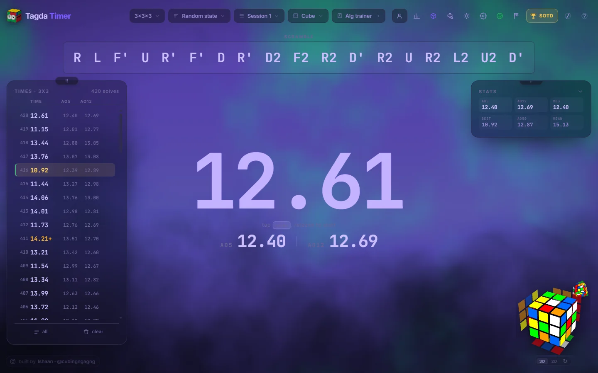

---

## Contents

- [Run it](#run-it)
- [Timing](#timing) — scrambles, inspection, input methods
- [Events](#events) — Fewest Moves, Relay, Blindfolded
- [Training](#training) — trainers, learn mode, alg trainer, Cross + 1, reconstruction
- [Statistics](#statistics) — averages, charts, the times list, share cards
- [Playing with other people](#playing-with-other-people) — race rooms, Scramble of the Day
- [Making it yours](#making-it-yours) — themes, backgrounds, panels, Spotify
- [Your data](#your-data) — storage, sync, import/export, offline, gear
- [Keyboard shortcuts](#keyboard-shortcuts)
- [Layout](#layout) · [Deploying](#deploying) · [Not in this version](#not-in-this-version)

---

## Run it

Double-click **`start.bat`**. Your browser opens on its own.

From a terminal instead:

```bash
python serve.py
```

> **Do not open `index.html` by double-clicking it.** Browsers refuse to load
> JavaScript modules from `file://` addresses, so you get a dead page with a
> frozen timer. It has to be served over http. If you do it anyway, the page
> tells you so rather than sitting there silently.

`serve.py` is a normal static server with caching turned off, so edits show up on
refresh instead of you fighting a stale cache.

There is **no build step**: no Node, no npm, no bundler. It is plain ES modules,
so any static file server works, and deploying means uploading the folder as-is.

To check everything still works after a change, open <http://localhost:5173/test.html>.
It tests the statistics maths, the learn-mode scheduler, every trainer algorithm (by
simulating a real cube), the reconstruction model and solver (superflip, the wide-turn
identities, and whole CFOP solves driven only by the suggestions it gives back), and
the rendered page itself (that no overlay is stuck on screen).

---

## Timing

### Scrambles
- **Every WCA event**: 2x2 through 7x7, 3BLD/4BLD/5BLD, FMC, OH, MBLD, Clock,
  Megaminx, Pyraminx, Skewb and Square-1. FTO and [Relay](#relay) are in the menu as well.
- Generated with **cubing.js**, which wraps the same random-state solvers TNoodle
  (the WCA's own scrambler) uses. These are competition-grade scrambles, not random moves.
- A **queue keeps three scrambles ready** at all times. A random-state 4x4 scramble
  takes about 3.5 seconds to compute, but you never wait for one, because the next is
  ready before you finish the current solve.
- cubing.js is **vendored into `vendor/`**, so scrambles work with no internet at all.
  Re-mirror it any time with `python tools/mirror_cubing.py`.
- **A static 3D preview** of the scrambled cube, which you can drag anywhere and
  spin. `V` switches to a flat 2D net, and Appearance → *Cube colours* recolours the stickers.
- **Fewest Moves scrambles are real FMC scrambles.** cubing.js already wraps the `333fm`
  scramble in `R' U' F` at both ends. That hides where the scramble really starts, so
  you cannot work a solution backwards out of it (WCA E2e).
- **Your own scrambles.** Paste a list (a competition round, a set of cases, ten
  thousand lines) and the generator steps aside. Every *next* gives you the following
  line, in order, and each solve is saved with the scramble it was done on. The
  list survives a reload, and the timer goes back to generating its own once the list
  runs out. Button beside the scramble, or `X`.
- `R` repeats the last solve's scramble; `←` / `→` step back and forward.

### Inspection
Exactly as in competition: 15 seconds, spoken or tonal callouts at 8 and 12, automatic
**+2 past 15 seconds** and automatic **DNF past 17**. The countdown is not a small number
in a corner. A ring of light drains around the screen edge, the background warms from
neutral to amber to red, and the digits breathe faster as time runs out.

Inspection is turned off automatically for the blindfolded events and FMC.

### Timing input
Four sources, one at a time, chosen in Settings → Timing input:

- **Keyboard / touch**: the spacebar, or a tap anywhere on a phone.
- **Typed times**: type under the clock and press Enter. It reads `12.34`, `1:05.67`,
  bare digits (`1234` is 12.34), `12.34+2` for a plus two, and `DNF`. Each entry is saved
  against the scramble on screen and moves on to the next.
- **Stackmat on the aux jack**: run a 3.5 mm cable from the timer's data port into the
  microphone socket. The 1200-baud stream is decoded in an AudioWorklet, either polarity,
  any Stackmat revision (it matches the packet checksum, not the frame length).
  A bar under the clock says whether packets are actually arriving, so a wrong socket or
  a muted input shows up in a second rather than a whole session later.
- **Virtual cube**: csTimer's keyboard cube. Every key on the letter block is one turn
  (`I`/`K` are R/R', `J`/`F` are U/U', and so on, mapped by physical key so it works on
  any layout). The first real turn starts the clock and a solved cube stops it. The cube
  sits in the middle of the screen with the clock on the right.

Bluetooth smart timers are deliberately **not** supported. Every model speaks its own
encrypted protocol, and code that has never been tested on one would be a button that fails silently.
The aux route works with any Stackmat, which is what those timers imitate anyway.

### Accuracy
All timing comes from `performance.now()` timestamps, never from counting frames, so no
amount of animation or lag can change a recorded time. The inspection penalty is read
from a fresh clock reading at the instant the timer starts, not from the last animation
frame.

A **metronome** (Settings → Timer) can tick while you solve, and a floating metronome
window with its own start/stop and a beat meter can sit over the timer or the alg trainer
while you drill a case to a beat.

---

## Events

### Fewest Moves

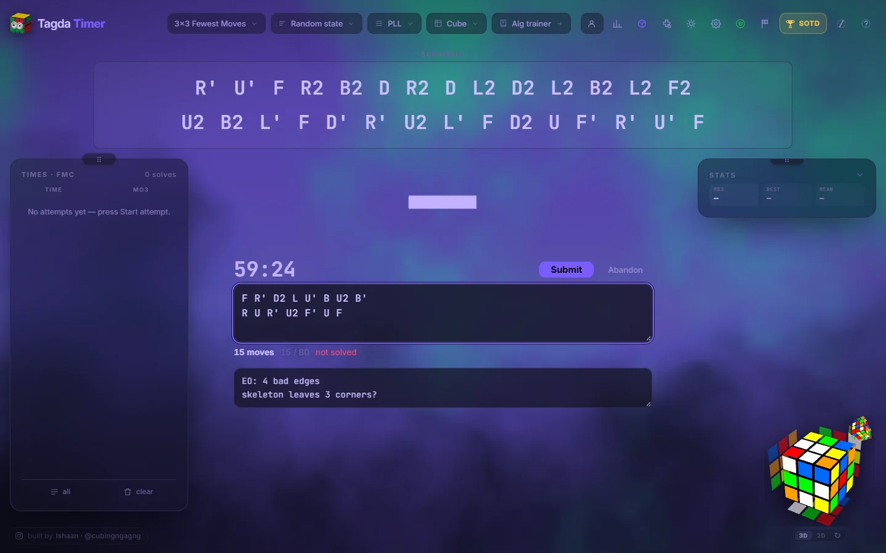

Picking 333fm replaces the hold-to-start timer with an attempt. **Start attempt** freezes
the scramble and starts a 60-minute countdown (WCA E2b). The countdown is worked out from
a timestamp, not counted in frames, and is kept in IndexedDB, so if the page reloads or
crashes forty minutes in, the attempt comes back with the right time left. There are calls
at five minutes and one minute, using the same tone as inspection.

You get a solution box and a scratch-notes box. Under the solution, live: the move count
in OBTM, the ETM count against the 80-move limit (amber near it, red over it; the limit
is on ETM but the score is OBTM, and the two numbers differ), the first illegal move
named and explained, and whether the cube is actually solved. The
cube preview shows the scramble with whatever you have typed applied, so an unfinished
solution shows how far you have got. Any final orientation counts.

**Submit** early is allowed; **Abandon** asks first and records a DNF; running out of time
submits a solution that works and records a DNF for one that does not. The move count, the
solution and the notes are all stored on the solve, so the history shows what you wrote,
including on a DNF, which is exactly the one you want to look back at. *Reconstruct this solve*
opens the workbench on the solution you already wrote down.

Notation is WCA 12a, strictly: outer faces, `Rw`-style outer blocks and `x y z` rotations.
`M`, `E` and `S` are refused. A move typed in the wrong case is read as the right one, and
a bare `r` counts as `R`, not `Rw`. That is what E2c6+ says, and the opposite of what
most cubing software does, so the app tells you rather than silently scoring
something you did not mean.

FMC is **scored in moves, not seconds**. The times list reads `28` rather than `0.03`,
the charts are labelled in moves, and the panel shows the mean of 3 and best single a
competitor actually sits (WCA 9b4a). The rolling ao5/ao12 are hidden, because nobody keeps
a rolling average of twelve one-hour attempts. One DNF makes a mean of 3 a DNF (9f11).

### Relay

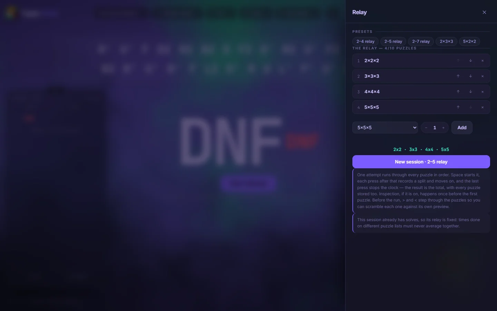

Pick **Relay** in the event menu to time several puzzles as one attempt: a 2–5 relay,
two 3x3s, five 2x2s, anything up to ten puzzles. The relay builder has presets (2–4,
2–5, 2–7, 2×3x3, 5×2x2), an event picker with a 1–5 count, and up/down buttons to
reorder. Only ordinary single-scramble events can go in (no blindfolded, FMC or
multi-blind), and scrambles are always random-state.

- **One attempt, one timer run.** Space starts it, every press in the middle records a
  split and moves to the next puzzle, and the last press stops the clock. The result is
  the total; each puzzle's own time is stored with the solve. +2 and DNF apply to the
  whole attempt, as in a WCA relay.
- **One puzzle on screen at a time.** A row of chips replaces the single scramble line,
  each showing upcoming, active, or done with its split. The scramble box and the 3D preview
  show only the active puzzle. Before the run, **<** / **>** or a click on a chip steps
  through them so you can scramble each one against its own preview. **all** swaps the box
  for a plain numbered list of every scramble, for printing or copying.
- **During the run** the chip row stays visible even in focus mode, and each puzzle's
  time stacks up beside the clock with "on 4x4 · 3 of 5" underneath.
- **Inspection**, if on, happens once before the first puzzle.
- **Each relay gets its own session.** Building one makes a session named after it;
  switching sessions switches relays, so two different puzzle lists never share an
  average. You can only edit a session's relay while it has no solves.
- The main stats and charts use the total. **Statistics** adds a per-puzzle card: mean and
  best split for each position and its share of the total. A solve's menu lists every
  split with its scramble, **Reconstruct** is offered for the 3x3 legs, the share card
  lists the scrambles as a table, and CSV export gains a `splits` column.
- Relays are not available in race rooms, Scramble of the Day, or with your own pasted
  scrambles.

### Blindfolded

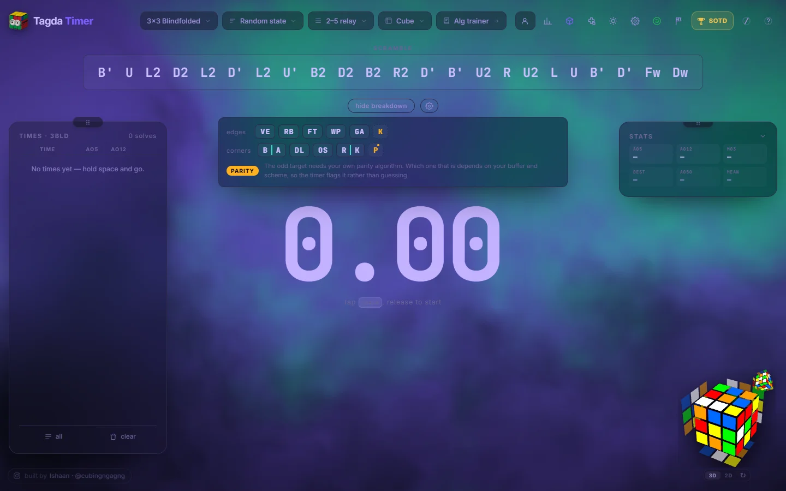

On 3BLD a **Show breakdown** button appears under the scramble. It stays collapsed until
you ask for it, and then reads the scramble out as your memo: edge and corner letter pairs
for your own buffer and letter scheme, cycle breaks marked, flipped and twisted pieces
flagged, and a parity badge when there is one. Buffers, the orientation the letters were
assigned in, and all 48 letters are editable in Settings → Blindsolving. Speffz and white
top / green front are only the defaults.

Click any pair to see the word, image, commutator and notes you saved for it, without
leaving the timer. On a blind event, the first press mid-solve ends the memo, not the
solve. Every solve therefore records a memo time and an execution time, and the statistics
drawer tracks how that split is drifting against your own average. After a DNF you can click
the pieces that were still wrong on a flat net and match them against the memo saved
with that solve.

The bigger blind events are timed and split like 3BLD but not traced. Only the 3x3 is
modelled, and guessing at wing and centre cycles would be worse than saying so.

---

## Training

### Trainers

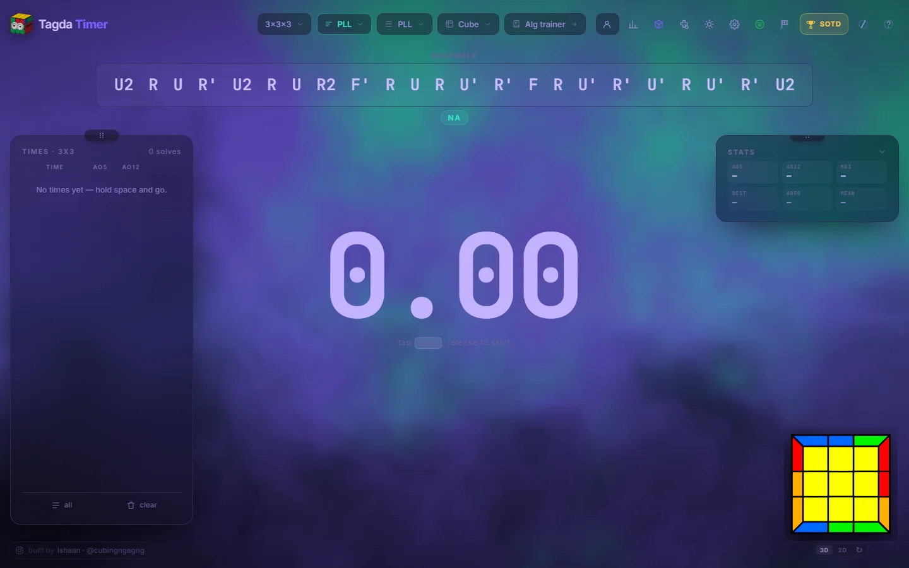

Every trainer knows which case it dealt you, which is what makes **per-case statistics**
possible: the app can tell you your G-perm is 1.4 s slower than everything else.
Picking a trainer opens a session of its own, so drilling PLLs never lands in your
full-solve averages.

| Mode | What you get |
|---|---|
| F2L | all 41 first-two-layers cases, grouped the way they are taught |
| PLL · OLL · ZBLL | all 21 · all 57 · all 472 (by family: T, U, L, H, Pi, Sune, Antisune) |
| 2-look OLL · 2-look PLL · OCLL | the beginner subsets |
| Winter Variation · COLL · OLLCP | the advanced last-slot and last-layer sets |
| 2-look CMLL · CMLL · OH CMLL · LSE EO · EOLR | Roux |
| Last layer | a random OLL and PLL stacked together |
| Cross solved | cross already done: drill F2L + LL |
| Last slot + LL | three pairs in, one to go |
| 2-gen (R,U) · Roux LSE (M,U) · Roux L10P | restricted move sets |
| Cross practice | full WCA scramble, time your cross only |

Press **K** to pick exactly which cases you want, including a "my worst 8" button that
selects the cases you are slowest at. Where a set has groups (F2L's six pair states,
ZBLL's seven families, OLL's shapes), a row of chips narrows the grid to one of them, and
`all` / `none` / `invert` then work on just what is showing. Picking only the Sune set out
of ZBLL's 472 is two clicks.

Trainer cases are previewed **yellow on top, white cross underneath**, the way the
algorithm sites draw them and the way you are already holding the cube. Official WCA
scrambles keep the white-on-top, green-front orientation they are defined in, because
there the preview's job is to match the cube you just scrambled. Turn it off under
Appearance → *Yellow on top*.

Every algorithm in the tables is verified by cube simulation in `test.html`: all 21 PLLs,
57 OLLs, 41 F2L cases and 472 ZBLLs produce the correct, distinct case.

### Learn mode
The trainers deal a case and time it. **Learn mode** (*learn these cases* in the case
picker) is the part that teaches you a case, and it works on top of whichever trainer you are already
in. PLL is still PLL; learn mode only changes *which* PLL you get next.

- **A case you have never seen arrives with its algorithm on screen.** There is
  nothing to recall yet, so nothing is hidden.
- **After that it is recall.** The alg is hidden; `G` brings it back, and asking for it
  counts as not knowing it. That is the whole signal, so it is never taken quietly.
- **It grades the solve you actually did.** A clean solve at or under your own average on
  that case moves it forward. A slow solve, or a +2, keeps it where it is. A DNF or a peek
  sends it back to the start and brings it back within a few solves,
  not tomorrow. "Slow" is a multiple of *your* average on *that* case, because 1.5x is
  a different number for a sub-10 solver and someone learning their first PLL.
- **A case is never marked known without the evidence.** Until a case has enough
  solves to have an average, everything passes. So a case stops one step
  short of *known* and waits for one, rather than graduating on three lucky attempts.
- **New cases arrive a few at a time** (five per sitting by default), so switching learn
  on in ZBLL teaches you five cases rather than dumping 472 unknowns on you.
- It works on exactly the cases switched on in the case picker, so *my worst 8* plus
  learn mode is a session about the eight cases you are worst at.
- The strip under the scramble shows where the set stands: how many cases are new,
  being learned, known, and due right now. When nothing is due it says so and goes back
  to dealing the set at random.
- Schedules are saved in your browser with everything else and included in the JSON
  backup. Restoring an old backup merges with your progress rather than resetting what
  you have learned since.

### Alg trainer

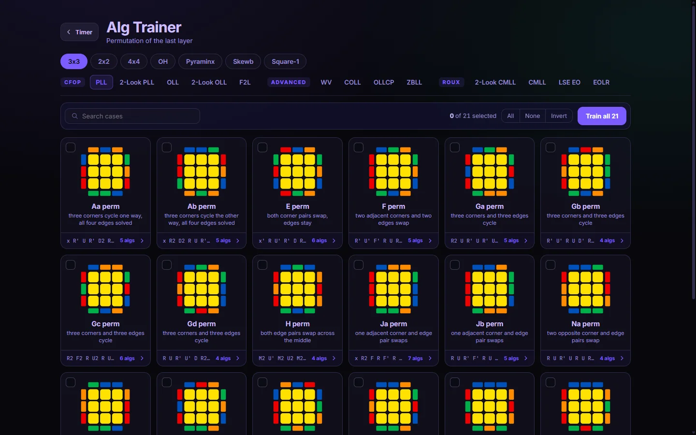

A full algorithm library on its own page (`algs.html`, the **Alg trainer** button in the
top bar), covering **3x3, 2x2, 4x4, OH, Pyraminx, Skewb and Square-1**. The 3x3 sets are
grouped by method: CFOP (PLL, 2-look PLL, OLL, 2-look OLL, F2L), Advanced (WV, COLL,
OLLCP, ZBLL) and Roux (2-look CMLL, CMLL, LSE EO, EOLR).

- **Every case is a picture first.** The name and group are metadata underneath, so
  you find a case by recognising it, not by remembering its letter.
- **Several ranked alternates per case**, each with its move count. Drag them into your
  own order, or add an alg the library does not list. Your order is personal and saved
  locally.
- **Setup moves for every case**, so practising means "do the setup, then solve it", not
  reading the alg backwards in your head. A setup that is just your own alg reversed is
  only used when nothing shorter exists.
- **Every alg is executed against its case** by `tools/verify-alglibrary.html` before it is
  committed. The scraped data did not all pass that check, and what failed was fixed or dropped.
- **Select cases and press *Train*** to drop them straight into the timer as a drill, in a
  session of their own.

### Cross + 1

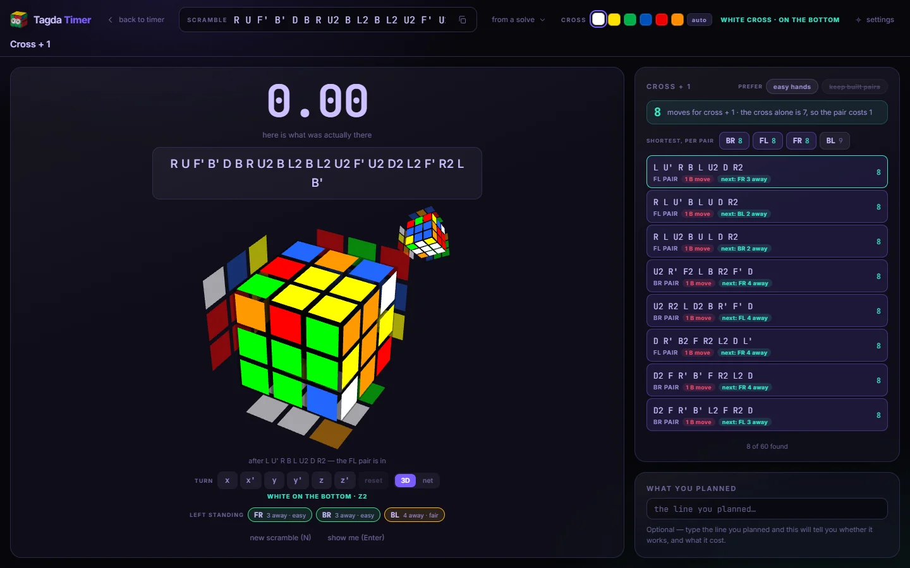

A trainer for planning the cross **and** the first F2L pair in inspection, not just the
cross. Open it with the cross-and-block icon in the top bar or `L`.

- You get a scramble and unlimited inspection. Plan your cross and first pair, then start
  the timer: the scramble and the cube preview **black out** and you solve on your real cube.
- When you stop, it shows what the solver found: every short cross + 1 line, which
  pair each one inserts, and how far away the remaining pairs are left. Sort by
  **shortest** or **easy on the hands**, and ask it to **keep built pairs**.
- Type the line you planned and it tells you whether it works and what it cost.
- Pick the cross colour (or `auto`), turn the cube, and drill your own scrambles or a past
  solve's.

### Reconstruction

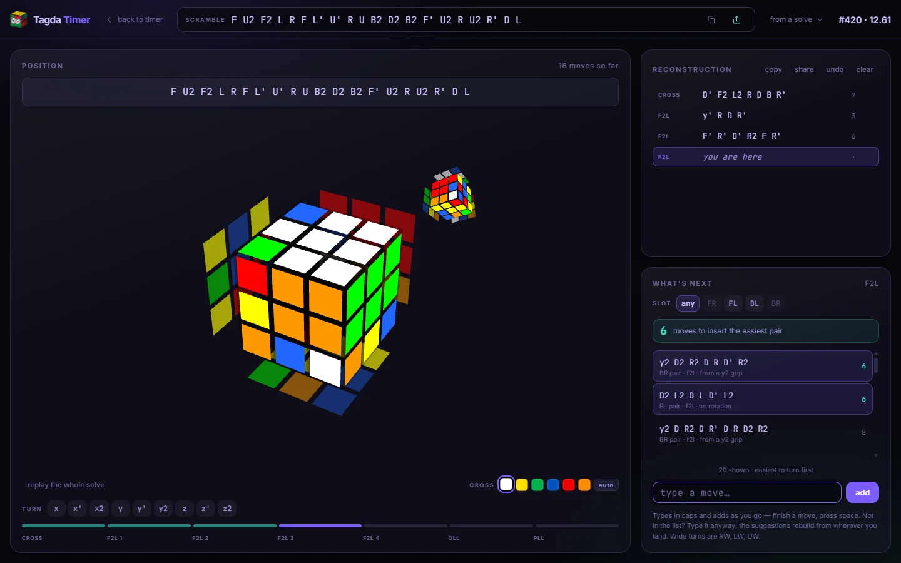

A workbench for working out what you actually did, and what you could have done
instead. It is a separate screen from the timer: it opens from a solve's menu
(*Reconstruct this solve*), the **reconstruct** button beside any row of the times list,
the topbar cube button, or `Y`.

- **It suggests the moves.** From wherever the cube currently stands, it works out
  every shortest way forward, ranked by move count and then by how comfortable they are to turn.
  The search runs in a worker, so a hard last-slot position can take a second or two of
  thinking without freezing the page (or the cube mid-turn).
  Cross and F2L are solved by search against a pruning table, so "6 moves" means six
  and not "six that I happened to find". The last layer is not searched, it is
  simulated against the full alg libraries, so you get the alg you recognise.
  **Pick the slot** (`FR` / `FL` / `BL` / `BR`) to see pairs for just that one.
- **Every spelling of the case, not just one.** The last-layer libraries carry
  every alg the community actually uses (228 for the 57 OLLs, 83 for the 21 PLLs),
  so the alg *your* fingers know is on the list. Every one is checked
  against the cube model in `test.html`.
- **ZBLL, when the edges are already oriented.** If F2L leaves the last layer's edges
  oriented, the whole layer can be solved with one alg instead of two. The panel
  spots that, checks all 472 ZBLL cases (1790 algs), and lists what it finds above the
  OLLs, tagged `ZBLL`.
- **Nothing is ever refused.** Type a move that is not in the list and it simply
  becomes the new position, with a fresh set of suggestions from there. The move counter
  goes up, and turns amber, when the move you made cost you something.
- **The cube keeps up.** Hover a suggestion and it plays on the cube; click it and the
  position advances. *Replay the whole solve* turns the panel into a playback you can
  scrub through, starting from the scramble.
- **The move box types in caps and adds as you go.** Finish a move, press space, and
  it lands. Wide turns are `RW`, `LW`, `UW`, stored and drawn as `Rw`, `Lw`, `Uw`.
- **Pick your cross colour** from six swatches, or `auto` to work it out from the cube
  (which reads a solve that starts `x2` or `z'` correctly).
- Reconstructions are **saved onto the solve**, split into cross, four pairs, OLL and PLL.
- **Copy it or make a card**: the whole thing as text, or a share card with the scramble,
  the cube it makes, and the solution one line per phase.

Any scramble works, not just a recorded solve. Paste one into the field at the top, or
pick a past solve from *from a solve*. Roux, ZZ and freestyle solves will not split into
phases cleanly, and the workbench says so rather than guessing.

---

## Statistics

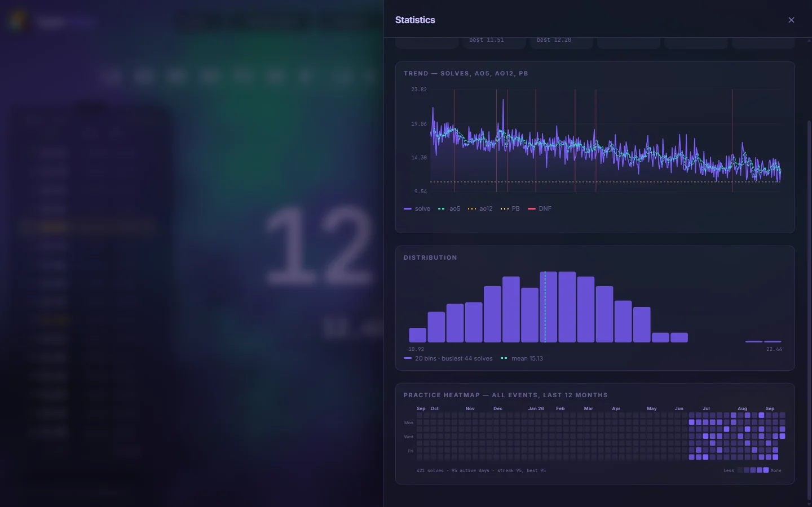

WCA-correct averages: trim the best and worst, DNFs count as worst, and two DNFs inside
a window make the whole average a DNF. Current and best ao5 / ao12 / ao50 / ao100 / ao1000,
mo3, mean, median, standard deviation, and a consistency score.

Five charts, all hand-drawn SVG: a trend line with rolling ao5/ao12, your PB and DNFs
marked; a distribution histogram; a practice heatmap with streaks; a consistency dial; and a
per-case ranking for trainer sessions. The trend line can be filtered to [one cube](#gear).

**New PBs are celebrated**: a chime, confetti, a shockwave and a PB ticker when you beat
your best single, ao5, ao12, ao25 or ao100. The chime can be turned off in Settings.

### The times list
The sidebar list scrolls all the way back to the first solve of the session, loading a
page at a time as you reach the bottom. Only what is on screen is built, and a re-render
changes only the rows that changed rather than rebuilding the list. On a 5,000-solve
session, loading another page takes about a millisecond, and toggling a penalty with every
row expanded about 30 ms, compared with two full seconds for a full rebuild.

Beside every time are two rolling averages: ao5 and ao12 by default, or whichever two
you actually chase. The pencil on a column heading lets you change it to an ao3, an ao25
or an ao100. Clicking a heading sorts the whole session by that column, fastest first;
clicking again puts the list back in solve order. Any average in the list opens the solves
behind it. Hover a row for its **reconstruct** button, or open its menu to set a penalty,
comment, share, or delete.

### Share cards

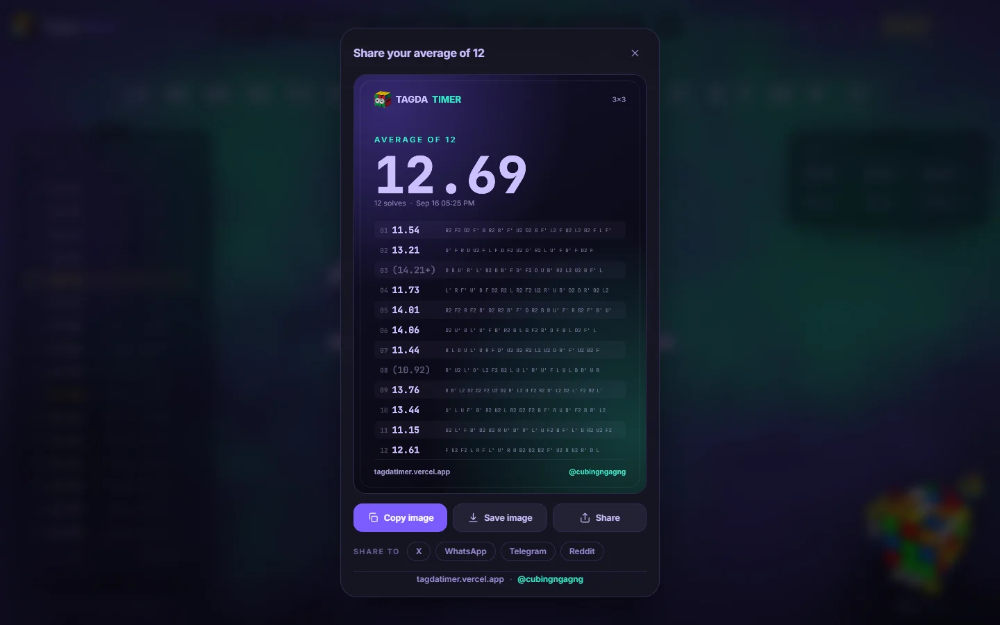

Any solve, and any average, can be exported as an image card rather than a wall of text.

- **One solve**: the time, the scramble, and the cube exactly as that scramble leaves
  it, drawn as a flat net from a sticker-by-sticker simulation, not a screenshot.
- **An average** (ao5, ao12, ao50, ao100, mo3): the counting times with their scrambles,
  trimmed solves in brackets the way results are written up.
- Copy the image, save the PNG, or hand it to the device's own share sheet (the only
  route that reaches Instagram). X, WhatsApp, Telegram and Reddit links are there too.
- The card takes its colours from whatever theme you are on.

Share a solve from its menu in the times list, an average from the `share card` button
on any statistic, or anything from the command palette.

---

## Playing with other people

Both of these need the Firebase project described in [RACE.md](RACE.md). With no
configuration, race rooms run in **local mode** between tabs of your own browser, which is
enough to develop against and demo.

### Race rooms
Open the flag icon in the top bar, create a room, and share the room code. Nobody needs
an account. Everyone in the room gets **the same scramble** and solves it whenever they are
ready, with their own inspection and their own clock. It is not a synchronised 3-2-1-go,
because network lag would make that unfair in a way nobody could see.

**You cannot see anyone's time until you have finished that scramble yourself.** Until
then you only see that they are *done*. That rule lives in the database, not the UI:
results are unreadable until your own is in, and write-once, so nobody can submit a
throwaway time, peek, and rewrite. Rooms keep standings across rounds, colour each result,
let you edit your own solve, and have a chat. By default each room gets its own session,
so race times do not mix into your practice averages. Details in [RACE.md](RACE.md).

### Scramble of the Day
The **SOTD** button in the top bar. Every day, every signed-in visitor gets the same
scramble per event and **one official attempt at it**, like a competition single. It
resets at **00:00 IST** for everyone, going by the server's clock rather than your
device's, so moving your clock does not get you tomorrow's scramble or a second attempt.

Pressing SOTD enters **the window**: the top bar, sidebars and panels disappear, leaving
today's scramble, the timer, and a slim bar with the day and how long is left of it. Submit
and the leaderboards slide up. Like race rooms, times are hidden until you have submitted
your own, and each result is write-once, apart from an optional one-line note you can edit.
Details in [DAILY.md](DAILY.md).

---

## Making it yours

| Nebula | Vaporwave |
|---|---|
|  | 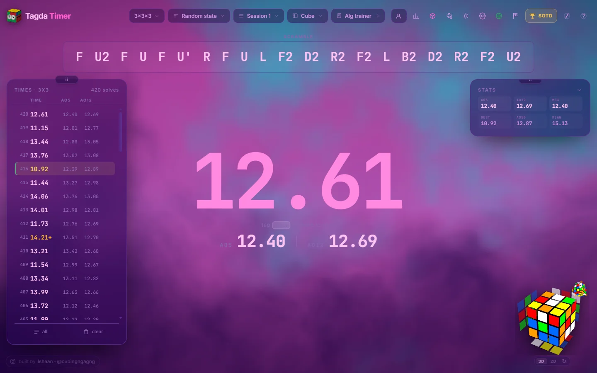 |
| **Terminal** | **Paper** |
| 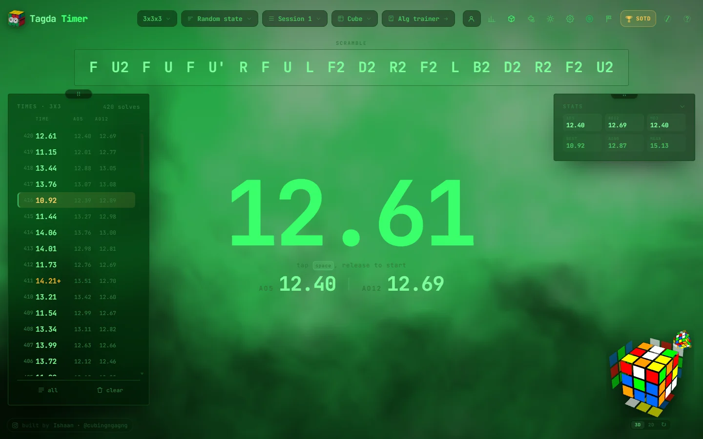 | 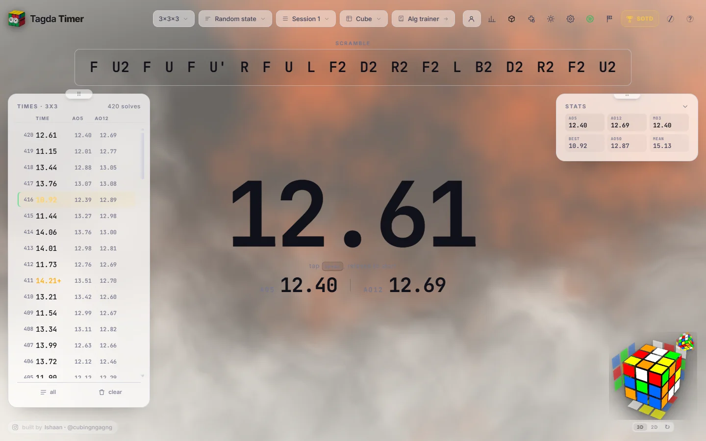 |

The entire design is built on CSS custom properties, so the Appearance panel (`T`)
updates the variables live: drag a slider and the app changes as you drag, no reload.

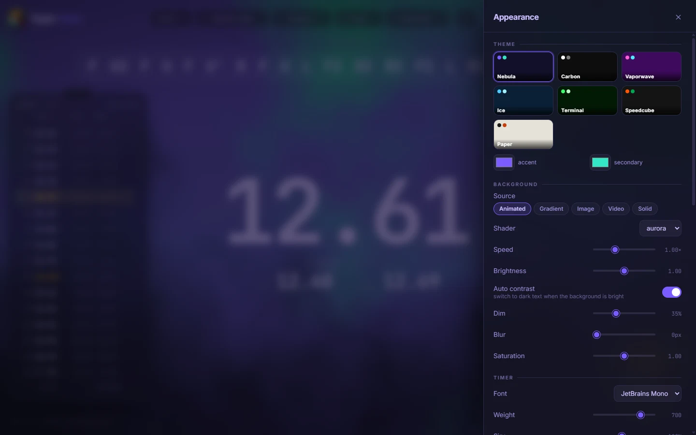

- Seven themes: Nebula, Carbon, Vaporwave, Ice, Terminal, Speedcube, Paper.
- Custom accent colours on top of any theme.
- Backgrounds: five animated WebGL shaders (aurora, mesh, plasma, grid, stars), a CSS
  gradient, a solid colour, **your own image**, or **your own looping video**. Uploaded
  media is stored in your browser and never leaves your machine.
- Background dim, blur, saturation and brightness, so any photo can be made readable, and
  **auto contrast** switches to dark text when the background is bright.
- Timer font (JetBrains Mono, Chivo Mono, Space Grotesk, Inter, system), weight, size and glow.
- Sizes for the scramble, the preview cube, the sidebar, the stats text and the solve list.
- **Cube colours**: six pickers for the preview's stickers.
- **Dockable panels.** Drag the times list, statistics, now-playing card or race panel by
  its grip. The left rail, right rail and bottom bar light up; drop it on one and it
  snaps in, or drop it anywhere else and it floats there.
- Show or hide any panel; widget or flat panel style; compact / comfortable / spacious density.
- Motion: full, reduced, or off (and `prefers-reduced-motion` is respected by default).
- Zen mode (`Z`) hides everything but the scramble and the clock.
- Export your theme as JSON and send it to someone.

### Phones

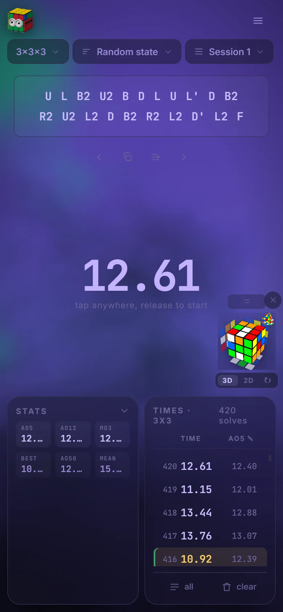

The layout rebuilds itself for a phone: tap anywhere to start and stop, the pickers
move under the logo, the rest of the top bar folds into a menu, and the panels stack
under the clock.

### Album theming (Spotify)
Connect Spotify (`P`) and the timer **tints itself from the album art of whatever is
playing**. Two colours are pulled from the cover and written into the accent colours,
with an optional album gradient. A sidebar card shows the cover, the track, a progress
bar, the two colours it picked, and play / next / previous. The palette only changes
**while the timer is idle**, never mid-solve, and disconnecting brings your real theme
straight back; the album tint is never saved to your settings. Details in
[SPOTIFY.md](SPOTIFY.md).

---

## Your data

Everything lives in your browser's IndexedDB, and stays there unless you sign in.

- **Sessions** per event, named, reordered and managed from the session picker (`S`).
- Full JSON backup and restore.
- Per-session CSV export.
- **csTimer import**: one picker takes either a Tagda backup (`.json`) or a csTimer
  export (`.txt`) and works out which it is from the contents, because csTimer writes
  JSON into a `.txt`, so the file extension cannot be trusted. Every session comes
  across with its name, times, scrambles, comments and penalties, and the event is read
  from the session's scramble type. Tested at ~12,000 solves across 23 sessions in under
  five seconds.

### Sync
**Sign in with Google** (the person icon in the top bar) and your solves, sessions and
settings follow you across devices. The first sign-in on a device asks once whether to
merge what is already there. A deleted solve stays deleted everywhere, instead of coming
back from another device. One username is shared by your account, race rooms and the SOTD
leaderboard, and can be edited from the account box.

### Offline
A service worker (`sw.js`) keeps a copy of the app, so the site opens with no connection
at all. Solves and settings were already in IndexedDB and scrambles are generated locally,
so once the page is up, timing never needs the network.

Works offline: the timer, every trainer, the alg trainer, statistics, the reconstructor,
Cross + 1, themes, gear, import and export.

Needs a connection: race rooms, Scramble of the Day, signing in, and Spotify.

If you are signed in and offline, solves are saved locally and upload on their own
the moment the connection comes back, with no reload. Only the page, scripts, styles and
fonts are cached; database and sign-in requests always go to the network. App files are
network-first, so a new deploy is picked up on the next load instead of being stuck behind the cache.

### Gear
The **Cube** picker in the top bar (`U`) is a log of the cubes on your desk: brand and
model, the tension you set, what you lubed it with, and a dated log of what you changed
(re-lubed, tension changed, magnets, cleaned, broke).

- **The cube you mark active is tagged onto every solve you record after that.** Past
  solves are left alone. Tagging them after the fact would invent exactly the answer the
  statistics exist to give you.
- **The trend chart can be filtered to one cube**, with a dashed line wherever you logged
  a change to it, so a step in your times can be read against the change that caused it.
- The pickers are seeded from `cubes.json` and `lubes.json`, but **they are autocomplete,
  never a fixed menu**. Anything you type is kept exactly as typed.
- Deleting a cube leaves its solves alone. They really were done on it.

---

## Keyboard shortcuts

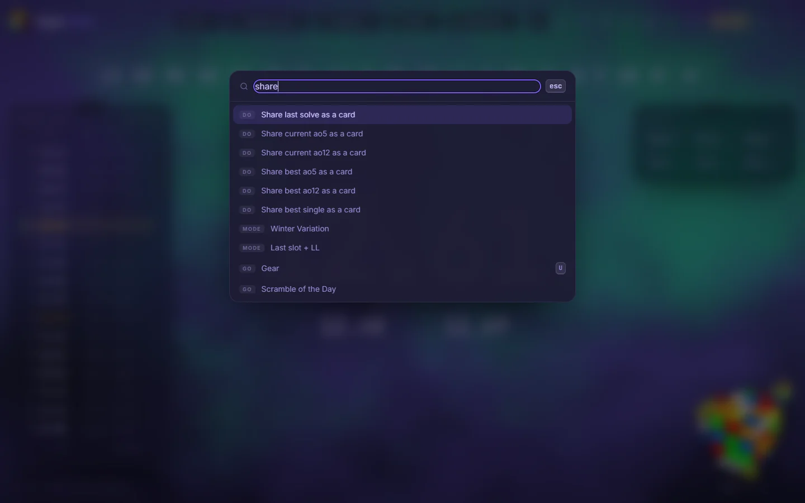

| | |
|---|---|
| **hold Space** | start / stop |
| **Esc** | cancel inspection, close any panel |
| **Delete** | delete the last solve |
| **Ctrl + Z** | undo that delete |
| **2** / **D** / **0** | +2 · DNF · clear penalty |
| **C** | comment on the last solve |
| **N** · **← →** | new scramble · previous / next scramble |
| **R** | repeat the last solve's scramble |
| **Ctrl + C** | copy the scramble |
| **X** | enter your own scrambles |
| **<** / **>** | previous / next puzzle in a relay |
| **E** / **M** / **S** | event · mode · session |
| **A** / **H** | statistics · all solves |
| **T** / **,** | appearance · settings |
| **U** | gear: your cubes, lube and tension |
| **P** | Spotify |
| **B** | about |
| **K** | pick trainer cases |
| **G** | show the alg in learn mode (counts as not knowing it) |
| **Y** | reconstruct |
| **L** | Cross + 1 trainer |
| **Ctrl + K** or **/** | command palette: every event, mode, panel and share card |
| **?** | shortcut list |
| **Z** / **F** / **V** | zen mode · fullscreen · 3D↔2D preview |
| **I** | toggle inspection |
| **Ctrl + Shift + Del** | clear the whole session |

Shortcuts are ignored while you are typing in a field, and while the virtual cube is
the input, the letter keys turn the cube instead.

---

## Layout

```
index.html              the timer
algs.html               the alg trainer
css/tokens.css          every design value, as CSS variables
css/base.css            reset, layout, background, timer
css/components.css      panels, controls, overlays, charts
css/recon.css           the reconstruction workbench (fetched on first open)
css/xplus1.css          the Cross + 1 trainer
css/alglibrary.css      the alg trainer page
js/main.js              wiring: the entry point
js/timer.js             timer state machine + WCA inspection
js/events.js            events, modes, relay definitions
js/scramble.js          cubing.js integration, trainers, pre-generation queue
js/learn.js             the learn-mode scheduler (pure, and tested)
js/learnmode.js         learn mode around it: which case next, the alg, the verdict
js/algs.js, algs2.js    trainer case tables (verified in test.html)
js/algsets.js           every OLL, PLL and ZBLL alg, all checked in test.html
js/alglibrary*.js       the alg trainer: data per set, setups, UI
js/stats.js             WCA-correct averages
js/charts.js            hand-built SVG charts
js/theme.js             settings model + live theming
js/contrast.js          auto contrast against whatever background is on screen
js/bg.js                WebGL background shaders
js/tiles.js, drag.js    dockable panels and floating widgets
js/cube.js              3D scramble preview
js/cubenet.js           sticker simulator and flat nets
js/cube3.js             the 3x3 model: notation, state, CFOP phase detection
js/solver.js            cross / F2L search, last layer by simulation
js/solver.worker.js     runs that search off the main thread
js/recon.js             the reconstruction workbench
js/xplus1.js            the Cross + 1 trainer
js/fmc.js, fmcmode.js   FMC notation and the attempt flow
js/bldtrace.js          3BLD memo tracing
js/stackmat.js          Stackmat decoding over the aux jack
js/vcube.js             the virtual (keyboard) cube
js/metro.js             the floating metronome window
js/race*.js             race rooms
js/daily*.js, dayid.js  Scramble of the Day
js/sync*.js             Google sign-in and cross-device sync
js/spotify*.js          Spotify link and album theming
js/albumpalette.js      colours from album art
js/sharecard.js         share card rendering
js/gear.js              the gear log
js/panels.js            settings / stats / history / case picker drawers
js/palette.js           the command palette
js/db.js                IndexedDB
js/fx.js                confetti, shockwave, audio callouts
sw.js                   service worker (offline)
cubes.json, lubes.json  gear picker seeds
vendor/cubing/          mirrored cubing.js (works offline)
tools/                  cubing.js mirror, alg library build and verification
serve.py                no-cache dev server
start.bat               double-click launcher
test.html               self test: open it in a browser to run it
firebase.rules.json     database rules for race rooms, SOTD and sync
```

Deeper write-ups: [RACE.md](RACE.md) · [DAILY.md](DAILY.md) · [SPOTIFY.md](SPOTIFY.md) ·
[CROSSPLUS1.md](CROSSPLUS1.md) · [ALGLIBRARY.md](ALGLIBRARY.md) ·
[BLIND_WORKFLOW.md](BLIND_WORKFLOW.md) · [PLAN.md](PLAN.md)

Screenshots in `docs/screenshots/` are taken from the running app.

---

## Deploying

The folder is already a static site: no build step, no server, no environment
variables:

```bash
npx vercel --prod
```

`vercel.json` is committed and sets the caching that matters: `vendor/` is
content-hashed so it is cached for a year, while `js/`, `css/` and
`index.html` are revalidated on every load, so a deploy can never leave a visitor with
half the old app and half the new one. `.vercelignore` keeps `sync-test.html`
out of the deployment — it is a developer page, and it writes to whatever
database the browser opening it is signed in to.

For GitHub Pages, push the folder to a `gh-pages` branch and enable Pages on it.
The `.nojekyll` file stops Jekyll from touching anything.

### Sign-in and the `/__/auth/*` proxy

Google sign-in normally opens a popup, and that popup reports its result back to
the page through a hidden iframe on Firebase's `authDomain`
(`tagda-timer.firebaseapp.com`). When the app is served from any other domain, that
iframe is third-party, so browsers that partition third-party storage by default
(Firefox strict mode, and therefore Zen; Safari's ITP) block the message. The
popup opens, Google signs you in, and the result never reaches the page. The only
way around that is a full-page redirect out to Google and back, which tears down the
running timer.

The fix is to stop being third-party. `vercel.json` rewrites `/__/auth/*` to the
firebaseapp.com handler, so the iframe and the popup are served from the app's
own origin and there is no partitioned storage left to block. Two things have to
line up for that, and sign-in breaks outright if only one of them does:

1. `SAME_ORIGIN_AUTH_HOSTS` in `js/raceapp.js` lists the hosts that actually
   have the rewrite. Anywhere else (localhost, a Vercel preview URL, a fork on
   another host), `/__/auth/*` is a 404, so those keep the firebaseapp.com
   default and fall back to the redirect flow.
2. Each host in that list needs `https://<host>/__/auth/handler` added to the
   **Authorized redirect URIs** of the project's OAuth client (Google Cloud
   Console → APIs & Services → Credentials → "Web client (auto created by Google
   Service)"), *and* the host itself in Firebase Console → Authentication →
   Settings → Authorized domains. Without the first, Google refuses the sign-in
   with `redirect_uri_mismatch`.

Deploying to a new domain therefore means editing `SAME_ORIGIN_AUTH_HOSTS`, both
console lists, and, on a host that is not Vercel, porting the rewrite to that
host's own config.

Whatever the host, it must serve the whole folder (`vendor/` included) with
JavaScript files as `text/javascript`. Every host above does that by default.

---

## Not in this version

Bluetooth smart cubes and Bluetooth smart timers.

Fewest Moves has no NISS helper, insertion finder or skeleton tools. It gives you the
clock, the box, the move count and an honest verdict; the thinking is yours. It is also
deliberately stricter than a judge about brackets: `(R U)` is refused, not read
as `R U`, because in a typed box a bracket means NISS or an insertion, and the moves
inside one are not necessarily the moves you performed, in the order you performed them.
FMC is excluded from race rooms and the Scramble of the Day, and it has no Stackmat or
typed-result input.

The reconstructor suggests and animates, but it cannot know what you actually turned.
Without a smart cube it removes the typing, not the remembering. It reads CFOP; Roux, ZZ and
freestyle solves will not split into phases cleanly, and it says so rather than guessing.
